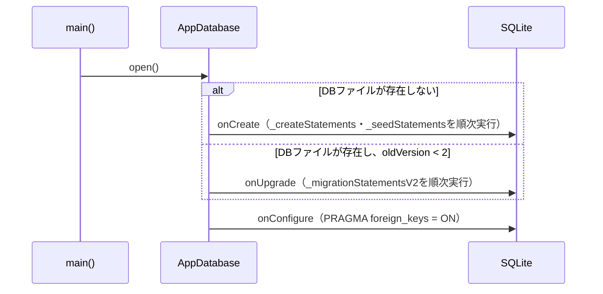

# AppDatabase（app_database.dart）

| 新規作成・更新日 | 作成・更新者名 | 作成・更新内容 |
|---|---|---|
| 2026-09-25 | minamiyama | 新規作成（ドキュメント未整備分を今回補完） |
| 2026-09-29 | minamiyama | ヘッダー管理機能（[db_schema.md](../../../../../requried/db_schema.md) v5、FR-6）に伴い、`version`を1→2に変更。`onUpgrade`コールバックを新設し、`m_header`への`category`・`is_visible`カラム追加（v1→v2マイグレーション）に対応。`_createStatements`の`CREATE TABLE m_header`にも同じ2カラムを追加し、新規インストール時とアップグレード時でスキーマを一致させた |

## 処理概要

アプリのSQLiteデータベースを開き、初回起動時にスキーマ（[db_schema.md](../../../../../requried/db_schema.md)）を適用するユーティリティ。既にインストール済みの端末では`onUpgrade`によるマイグレーションでスキーマを追従させる。GitHub Release経由で配布されるアプリの特性上、利用者のローカルDBを壊さない追加のみの安全なマイグレーションとする方針。

## 処理シーケンス図

## open

### 処理概要
データベースを開く。ファイルが存在しない場合は`_createStatements`・`_seedStatements`でスキーマを新規作成する。既存ファイルのスキーマバージョンが現行バージョン（2）未満の場合は`_migrationStatementsV2`でマイグレーションする。

### input

なし

### output

| 項目論理名 | 項目物理名 | カプセルの型 | データ型 | 備考 |
|---|---|---|---|---|
| データベース | - | - | `Database`（sqflite） | - |

### exception

なし

### 処理詳細
1. `getDatabasesPath`と固定ファイル名（`m3_pad.db`）からDBファイルパスを組み立てる。
2. `openDatabase`を`version=2`で呼び出す。\
   条件a: DBファイルが存在しない場合（`onCreate`）、`_createStatements`を1件ずつ順次実行し、続けて`_seedStatements`（`m_header_type`の固定5件シード）を1件ずつ順次実行する。\
   条件b: DBファイルが存在し、`oldVersion < 2`の場合（`onUpgrade`）、`_migrationStatementsV2`（`m_header`への`category`・`is_visible`カラム追加）を1件ずつ順次実行する。\
   条件c: DBファイルが存在し、`oldVersion >= 2`の場合、マイグレーションを行わない。
3. `onConfigure`で`PRAGMA foreign_keys = ON`を実行し、外部キー制約を有効化する。
4. 開いた`Database`を返却する。

## _migrationStatementsV2

v1→v2マイグレーション（[db_schema.md](../../../../../requried/db_schema.md) §2.3参照）: `m_header`に`category TEXT`（`none`/`drink`/`bottle`/`food`、デフォルト`none`）・`is_visible INTEGER`（真偽値、デフォルト1＝表示）を追加のみ行う`ALTER TABLE`文2件。既存の`m_header`行はいずれも新カラムがデフォルト値で埋まるため、既存データへの影響はない。
