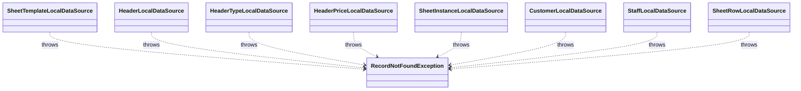

# RecordNotFoundException（record_not_found_exception.dart）

| 新規作成・更新日 | 作成・更新者名 | 作成・更新内容 |
|---|---|---|
| 2026-09-25 | minamiyama | 新規作成 |
| 2026-09-25 | minamiyama | agents.md階層改訂に伴い`core/errors/`へ移動 |

## 概要

各データソース（[`data/datasources/`](../../features/voucher/data/datasources/)）の`findById`系メソッドで、指定したIDのレコードが存在しない場合に送出する共有の例外クラス。エンティティ種別ごとに専用の例外クラスを作らず、`entityName`・`id`を保持する汎用クラスとして表現する。usecase層（[`domain/usecases/`](../../features/voucher/domain/usecases/)）まで伝播し、呼び出し元が捕捉する。

## 依存関係シーケンス図

## 項目一覧

| 項目論理名 | 項目物理名 | カプセルの型 | データ型 | バリデーション | 備考 |
|---|---|---|---|---|---|
| エンティティ名 | entityName | - | string | 必須 | 例:「SheetTemplate」「Header」 |
| 検索ID | id | - | string | 必須 | 見つからなかった検索キーの値 |
