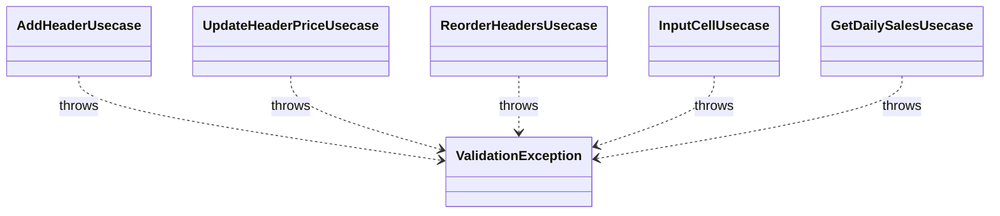

# ValidationException（validation_exception.dart）

| 新規作成・更新日 | 作成・更新者名 | 作成・更新内容 |
|---|---|---|
| 2026-09-25 | minamiyama | 新規作成 |
| 2026-09-25 | minamiyama | agents.md階層改訂に伴い`core/errors/`へ移動 |

## 概要

DBの制約（NOT NULL・CHECK等）では表現できない業務ルール違反（例: 価格対象の列に単価未指定、並び替え対象件数の不一致、数量未入力等）が発生した場合にusecase層（[`domain/usecases/`](../../features/voucher/domain/usecases/)）が送出する共有の例外クラス。ルールごとに専用の例外クラスを作らず、`reason`に違反内容の説明文を保持する汎用クラスとして表現する。

## 依存関係シーケンス図

## 項目一覧

| 項目論理名 | 項目物理名 | カプセルの型 | データ型 | バリデーション | 備考 |
|---|---|---|---|---|---|
| 違反理由 | reason | - | string | 必須 | 例:「isPriced=trueの列にはinitialPriceが必須です」 |
