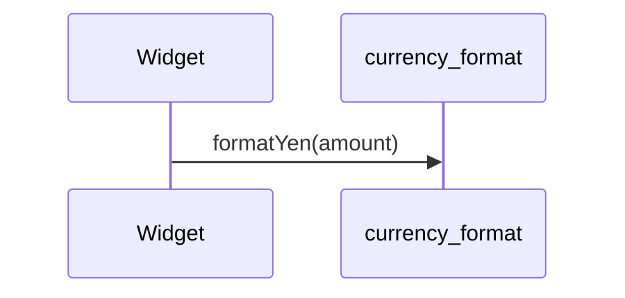

# currency_format（currency_format.dart）

| 新規作成・更新日 | 作成・更新者名 | 作成・更新内容 |
|---|---|---|
| 2026-09-29 | minamiyama | 新規作成。金額表示を3桁区切りカンマ付きに統一するため新設 |

## 処理概要

金額を3桁区切りカンマ付きの「¥」表示文字列に変換する共有ユーティリティ関数群。[VoucherHeaderRow](../features/voucher/presentation/widgets/voucher_header_row.md)（単価）・[VoucherTotalCell](../features/voucher/presentation/widgets/voucher_total_cell.md)（合計金額）・[VoucherDailySummaryRow](../features/voucher/presentation/widgets/voucher_daily_summary_row.md)（本日の合計・決済方法別内訳）が呼び出す。金額表示の書式を1箇所に集約することで、ウィジェットごとに書式ロジックを重複記述しない（冗長な設計の回避）。

## 処理シーケンス図

## formatYen

### 処理概要
金額を`¥1,234`のような3桁区切りカンマ付きの文字列に変換する。

### input

| 項目論理名 | 項目物理名 | カプセルの型 | データ型 | バリデーション | 備考 |
|---|---|---|---|---|---|
| 金額 | amount | - | int | 必須 | 負の値も許容する（`-`は「¥」の直後に付与） |

### output

| 項目論理名 | 項目物理名 | カプセルの型 | データ型 | 備考 |
|---|---|---|---|---|
| 整形済み文字列 | - | - | string | 例: `1200` → `¥1,200` |

### exception

なし

### 処理詳細
1. `amount`の絶対値を10進文字列に変換する。
2. 末尾から3桁ごとにカンマ（`,`）を挿入する。
3. `amount`が負の値の場合、手順2の文字列の先頭に`-`を付与する。
4. 手順3の文字列の先頭に`¥`を付与して返却する。
