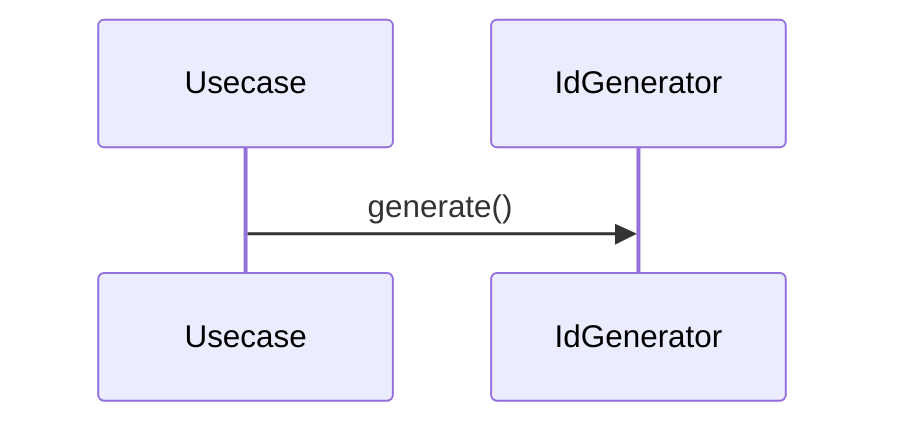

# IdGenerator（id_generator.dart）

| 新規作成・更新日 | 作成・更新者名 | 作成・更新内容 |
|---|---|---|
| 2026-09-25 | minamiyama | 新規作成 |

## 処理概要

エンティティの主キー（[db_schema.md](../../../../../requried/db_schema.md) §9運用ルールで定めるULID）を発行する共有ユーティリティ。各usecase（[`domain/usecases/`](../features/voucher/domain/usecases/)）が新規エンティティ作成時に呼び出す。IDの発行方法を1箇所に集約することで、usecaseごとにULID生成ロジックを重複記述しない（冗長な設計の回避）。

## 処理シーケンス図

## generate

### 処理概要
新しいULID文字列を1件生成する。

### input

なし

### output

| 項目論理名 | 項目物理名 | カプセルの型 | データ型 | 備考 |
|---|---|---|---|---|
| ID文字列 | - | - | string | ULID仕様（26文字、Crockford's Base32）に準拠 |

### exception

なし

### 処理詳細
1. 現在時刻（ミリ秒）とランダムビット列から、ULID仕様に基づく26文字の文字列を生成する。
2. 生成した文字列を返却する。
