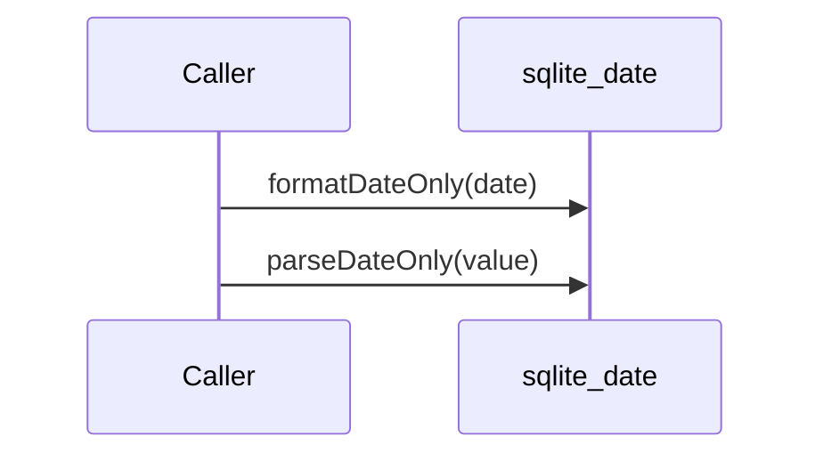

# sqlite_date（sqlite_date.dart）

| 新規作成・更新日 | 作成・更新者名 | 作成・更新内容 |
|---|---|---|
| 2026-09-29 | minamiyama | 新規作成 |

## 処理概要

SQLiteの日付のみ（`YYYY-MM-DD`）カラムと`DateTime`を相互変換する共有ユーティリティ関数群。各データソース（[`data/datasources/`](../features/voucher/data/datasources/)）・[ExportDailySheetToCsvUsecase](../features/voucher/domain/usecases/export_daily_sheet_to_csv_usecase.md)が呼び出す。日付書式の変換ロジックを1箇所に集約することで、呼び出し元ごとに重複記述しない（冗長な設計の回避）。

## 処理シーケンス図

## formatDateOnly

### 処理概要
`DateTime`を`YYYY-MM-DD`形式の文字列に変換する。

### input

| 項目論理名 | 項目物理名 | カプセルの型 | データ型 | バリデーション | 備考 |
|---|---|---|---|---|---|
| 日付 | date | - | DateTime | 必須 | 時刻部分は無視する |

### output

| 項目論理名 | 項目物理名 | カプセルの型 | データ型 | 備考 |
|---|---|---|---|---|
| 整形済み文字列 | - | - | string | `YYYY-MM-DD`形式 |

### exception

なし

### 処理詳細
1. `date`をISO 8601形式の文字列に変換する。
2. 先頭10文字（`YYYY-MM-DD`部分）を切り出して返却する。

## parseDateOnly

### 処理概要
`YYYY-MM-DD`形式の文字列を`DateTime`に変換する。

### input

| 項目論理名 | 項目物理名 | カプセルの型 | データ型 | バリデーション | 備考 |
|---|---|---|---|---|---|
| 文字列 | value | - | string | 必須 | `YYYY-MM-DD`形式 |

### output

| 項目論理名 | 項目物理名 | カプセルの型 | データ型 | 備考 |
|---|---|---|---|---|
| 日付 | - | - | DateTime | 時刻部分は`00:00:00`として生成される |

### exception

| exception論理名 | exception物理名 | エラーコード | エラーメッセージ | 備考 |
|---|---|---|---|---|
| 書式不正 | FormatException | - | - | `value`が`YYYY-MM-DD`形式でない場合（Dart標準ライブラリが送出） |

### 処理詳細
1. `value`を`DateTime.parse`で解析し、`DateTime`として返却する。
