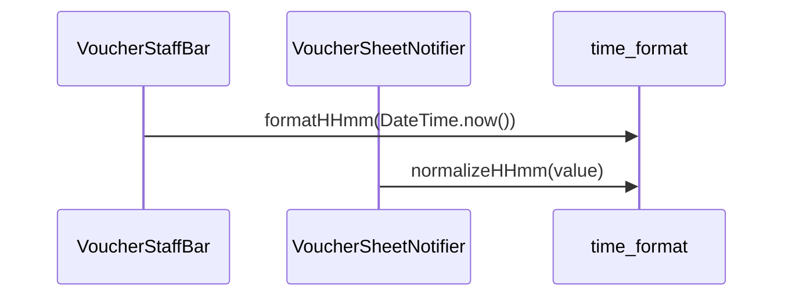

# time_format（time_format.dart）

| 新規作成・更新日 | 作成・更新者名 | 作成・更新内容 |
|---|---|---|
| 2026-10-03 | minamiyama | 新規作成。就業時刻の表示・入力値を`HH:mm`形式に統一するため新設 |

## 処理概要

時刻を`HH:mm`形式（24時間表記・ゼロ埋め）の文字列で扱う共有ユーティリティ関数群。[VoucherStaffBar](../features/voucher/presentation/widgets/voucher_staff_bar.md)（未入力時の現在時刻表示）・[VoucherSheetNotifier.commitStaffShiftTime](../features/voucher/presentation/controllers/voucher_sheet_notifier.md#commitstaffshifttime)（入力値の正規化）が呼び出す。端末の12/24時間表記設定に依存する`TimeOfDay.format`は使用せず、[StaffShift](../features/voucher/domain/entities/staff_shift.md)の`startTime`/`endTime`の保存形式（`HH:mm`）に揃える。

## 処理シーケンス図

## formatHHmm

### 処理概要
日時の時・分を`HH:mm`形式の文字列に変換する。

### input

| 項目論理名 | 項目物理名 | カプセルの型 | データ型 | バリデーション | 備考 |
|---|---|---|---|---|---|
| 日時 | dateTime | - | DateTime | 必須 | 時・分のみ使用する |

### output

| 項目論理名 | 項目物理名 | カプセルの型 | データ型 | 備考 |
|---|---|---|---|---|
| 整形済み文字列 | - | - | string | 例: 9時5分 → `09:05` |

### exception

なし

### 処理詳細
1. `dateTime.hour`・`dateTime.minute`をそれぞれ2桁にゼロ埋めする。
2. `:`で連結して返却する。

## normalizeHHmm

### 処理概要
入力された時刻文字列を`HH:mm`形式に正規化する。形式不正・範囲外の場合は`null`を返す。

### input

| 項目論理名 | 項目物理名 | カプセルの型 | データ型 | バリデーション | 備考 |
|---|---|---|---|---|---|
| 入力文字列 | input | - | string | 必須 | 時刻入力欄の入力値 |

### output

| 項目論理名 | 項目物理名 | カプセルの型 | データ型 | 備考 |
|---|---|---|---|---|
| 正規化済み文字列 | - | optional | string | 例: `9:05`→`09:05`、`１８：３０`→`18:30`、`1830`→`18:30`、`24:00`→`null` |

### exception

なし（不正な入力は`null`で返す）

### 処理詳細
1. `input`の前後の空白を除去し、全角数字（`０`〜`９`）・全角コロン（`：`）を半角に変換する。
2. 手順1の文字列が`H:mm`・`HH:mm`・`Hmm`・`HHmm`のいずれかに一致しない場合は`null`を返す。
3. 時が0〜23、分が0〜59の範囲外の場合は`null`を返す。
4. 時・分をそれぞれ2桁にゼロ埋めし、`:`で連結して返却する。
