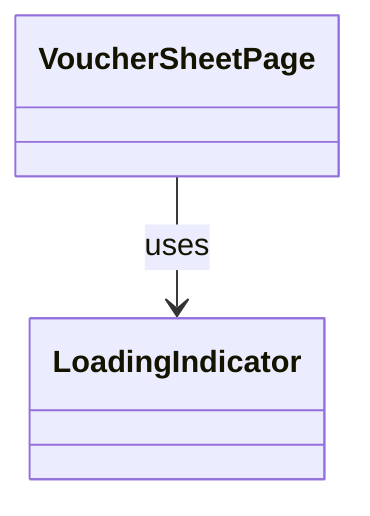

# LoadingIndicator（loading_indicator.dart）

| 新規作成・更新日 | 作成・更新者名 | 作成・更新内容 |
|---|---|---|
| 2026-09-25 | minamiyama | 新規作成 |

## 概要

読込中（Loading）状態を示す共通UIコンポーネント。画面中央に円形のプログレスインジケータを表示する。特定機能に依存しないため`core/widgets/`に配置し、[VoucherSheetPage](../../features/voucher/presentation/pages/voucher_sheet_page.md)をはじめ、Loading状態を持つ全ページから利用される想定。

## 依存関係シーケンス図

## 項目一覧

| 項目論理名 | 項目物理名 | カプセルの型 | データ型 | バリデーション | 備考 |
|---|---|---|---|---|---|
| 表示メッセージ | message | optional | string | 任意 | インジケータ下に補足文言を表示したい場合のみ指定。未指定時は非表示 |
