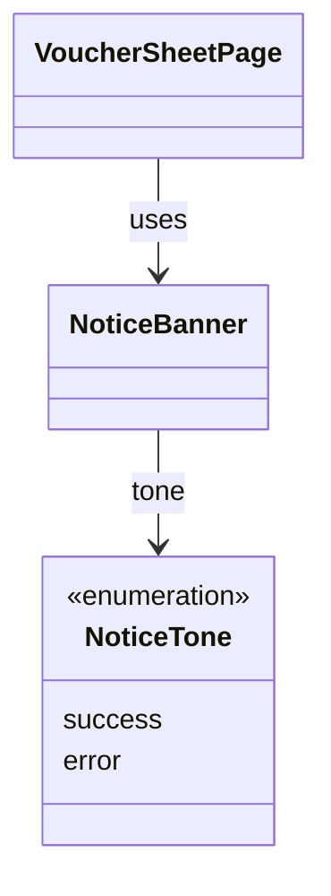

# NoticeBanner（notice_banner.dart）

| 新規作成・更新日 | 作成・更新者名 | 作成・更新内容 |
|---|---|---|
| 2026-09-25 | minamiyama | 新規作成 |

## 概要

画面上部にお知らせ文を表示する共通UIコンポーネント。副作用（Side Effect）による1回限りの通知（処理成功・失敗のメッセージ等）を、モーダルやスナックバーではなく画面上部の帯（バナー）として表示するために使用する。特定機能に依存しないため`core/widgets/`に配置し、[VoucherSheetPage](../../features/voucher/presentation/pages/voucher_sheet_page.md)をはじめ、副作用の通知が必要な全ページから利用される想定。表示後は一定時間で自動的に消える、またはタップで閉じられる。

## 依存関係シーケンス図

## 項目一覧（コンストラクタ引数）

| 項目論理名 | 項目物理名 | カプセルの型 | データ型 | バリデーション | 備考 |
|---|---|---|---|---|---|
| お知らせ文 | message | - | string | 必須 | - |
| 表示トーン | tone | - | NoticeTone | 必須 | `success`（成功時、緑系の配色）／`error`（失敗時、赤系の配色） |
| 表示時間 | duration | optional | Duration | 任意 | 未指定時は既定値（例: 4秒）で自動的に非表示にする |
