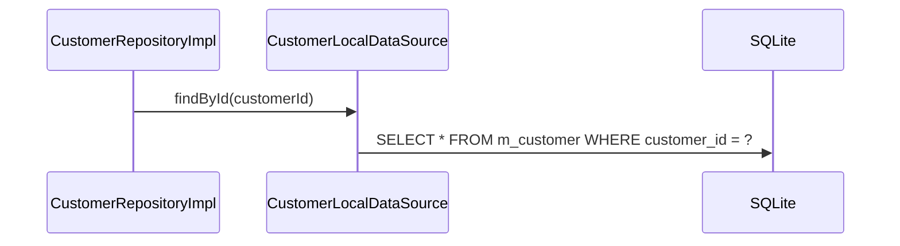

# CustomerLocalDataSource（customer_local_datasource.dart）

| 新規作成・更新日 | 作成・更新者名 | 作成・更新内容 |
|---|---|---|
| 2026-09-25 | minamiyama | 新規作成 |

## 処理概要

`m_customer`テーブルに対する実際のSQL実行を担うローカルデータソース。[CustomerRepositoryImpl](../repositories/customer_repository_impl.md)から呼び出され、[CustomerModel](../models/customer_model.md)を介してSQLiteの行とやり取りする。

## 処理シーケンス図



## findById

### 処理概要
`customerId`に一致する有効な[CustomerModel](../models/customer_model.md)を1件取得する。

### input

| 項目論理名 | 項目物理名 | カプセルの型 | データ型 | バリデーション | 備考 |
|---|---|---|---|---|---|
| 顧客ID | customerId | - | string | 必須 | - |

### output

| 項目論理名 | 項目物理名 | カプセルの型 | データ型 | 備考 |
|---|---|---|---|---|
| 顧客 | - | - | [CustomerModel](../models/customer_model.md) | - |

### exception

| exception論理名 | exception物理名 | エラーコード | エラーメッセージ | 備考 |
|---|---|---|---|---|
| レコード未検出 | [RecordNotFoundException](../../../../core/errors/record_not_found_exception.md) | - | - | `entityName="Customer"`, `id=customerId` |

### 処理詳細
1. 以下のSQLをDBに対して1回発行する。
   ```sql
   SELECT * FROM m_customer WHERE customer_id = :customerId AND status = 'active';
   ```
   条件a: 取得結果が0件の場合、`RecordNotFoundException`を送出し処理を終了する。\
   条件b: 取得結果が1件の場合、次のステップへ進む。
2. 取得した1件を[CustomerModel.fromMap](../models/customer_model.md)で変換して返却する。
