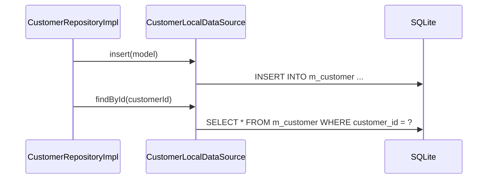

# CustomerLocalDataSource（customer_local_datasource.dart）

| 新規作成・更新日 | 作成・更新者名 | 作成・更新内容 |
|---|---|---|
| 2026-09-25 | minamiyama | 新規作成 |
| 2026-09-27 | minamiyama | `insert`を追加（お名前欄への入力による新規顧客の作成に対応）。`findByIds`を追加（[SheetDetail.customersById](../../domain/entities/sheet_detail.md)の一括取得用） |
| 2026-09-29 | minamiyama | `findByName`を追加（同名の既存顧客との重複作成を避けるための名前検索） |

## 処理概要

`m_customer`テーブルに対する実際のSQL実行を担うローカルデータソース。[CustomerRepositoryImpl](../repositories/customer_repository_impl.md)から呼び出され、[CustomerModel](../models/customer_model.md)を介してSQLiteの行とやり取りする。

## 処理シーケンス図


```mermaid
sequenceDiagram
    participant R as CustomerRepositoryImpl
    participant D as CustomerLocalDataSource
    participant DB as SQLite

    R->>D: insert(model)
    D->>DB: INSERT INTO m_customer ...
    R->>D: findById(customerId)
    D->>DB: SELECT * FROM m_customer WHERE customer_id = ?
```

## insert

### 処理概要
新しい[CustomerModel](../models/customer_model.md)を1件永続化する。

### input

| 項目論理名 | 項目物理名 | カプセルの型 | データ型 | バリデーション | 備考 |
|---|---|---|---|---|---|
| 顧客 | model | - | [CustomerModel](../models/customer_model.md) | 必須 | - |

### output

| 項目論理名 | 項目物理名 | カプセルの型 | データ型 | 備考 |
|---|---|---|---|---|
| - | - | - | void | - |

### exception

なし

### 処理詳細
1. `model.toMap`で変換した`Map`を値としたINSERT文をDBに対して1回発行する。
   ```sql
   INSERT INTO m_customer (customer_id, name, gender, status, created_at, updated_at)
   VALUES (:customerId, :name, :gender, :status, :createdAt, :updatedAt);
   ```

## findByIds

### 処理概要
複数の`customerId`に紐づく有効な[CustomerModel](../models/customer_model.md)を一括取得する。行ごとにループしてDBを呼び出すことを避けるため使用する。`customerIds`が空リストの場合はSQLを発行せず空リストを返す。

### input

| 項目論理名 | 項目物理名 | カプセルの型 | データ型 | バリデーション | 備考 |
|---|---|---|---|---|---|
| 顧客IDリスト | customerIds | list | string | 必須, 空リスト許容 | - |

### output

| 項目論理名 | 項目物理名 | カプセルの型 | データ型 | 備考 |
|---|---|---|---|---|
| 顧客一覧 | - | list | [CustomerModel](../models/customer_model.md) | 該当なしの場合は空リスト |

### exception

なし

### 処理詳細
1. `customerIds`が空リストの場合、空リストを返却し処理を終了する。
2. `customerIds`を`IN`句のプレースホルダに展開したSQLをDBに対して1回発行する。
   ```sql
   SELECT * FROM m_customer WHERE customer_id IN (:customerId1, :customerId2, ...) AND status = 'active';
   ```
3. 取得結果を[CustomerModel.fromMap](../models/customer_model.md)でそれぞれ変換し、リストとして返却する。

## findById

### 処理概要
`customerId`に一致する有効な[CustomerModel](../models/customer_model.md)を1件取得する。

### input

| 項目論理名 | 項目物理名 | カプセルの型 | データ型 | バリデーション | 備考 |
|---|---|---|---|---|---|
| 顧客ID | customerId | - | string | 必須 | - |

### output

| 項目論理名 | 項目物理名 | カプセルの型 | データ型 | 備考 |
|---|---|---|---|---|
| 顧客 | - | - | [CustomerModel](../models/customer_model.md) | - |

### exception

| exception論理名 | exception物理名 | エラーコード | エラーメッセージ | 備考 |
|---|---|---|---|---|
| レコード未検出 | [RecordNotFoundException](../../../../core/errors/record_not_found_exception.md) | - | - | `entityName="Customer"`, `id=customerId` |

### 処理詳細
1. 以下のSQLをDBに対して1回発行する。
   ```sql
   SELECT * FROM m_customer WHERE customer_id = :customerId AND status = 'active';
   ```
   条件a: 取得結果が0件の場合、`RecordNotFoundException`を送出し処理を終了する。\
   条件b: 取得結果が1件の場合、次のステップへ進む。
2. 取得した1件を[CustomerModel.fromMap](../models/customer_model.md)で変換して返却する。

## findByName

### 処理概要
`name`に完全一致する有効な[CustomerModel](../models/customer_model.md)を1件取得する。未検出時は例外ではなく`null`を返す（同名の既存顧客と重複作成しないよう、呼び出し元が事前に存在確認するために使用する）。

### input

| 項目論理名 | 項目物理名 | カプセルの型 | データ型 | バリデーション | 備考 |
|---|---|---|---|---|---|
| 氏名 | name | - | string | 必須 | - |

### output

| 項目論理名 | 項目物理名 | カプセルの型 | データ型 | 備考 |
|---|---|---|---|---|
| 顧客 | - | optional | [CustomerModel](../models/customer_model.md) | 該当なしの場合は`null` |

### exception

なし

### 処理詳細
1. 以下のSQLをDBに対して1回発行する（`LIMIT 1`）。
   ```sql
   SELECT * FROM m_customer WHERE name = :name AND status = 'active' LIMIT 1;
   ```
   条件a: 取得結果が0件の場合、`null`を返却し処理を終了する。\
   条件b: 取得結果が1件の場合、次のステップへ進む。
2. 取得した1件を[CustomerModel.fromMap](../models/customer_model.md)で変換して返却する。
