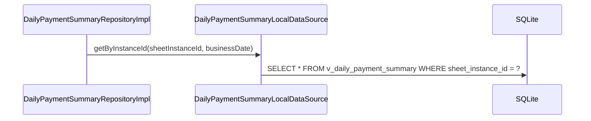

# DailyPaymentSummaryLocalDataSource（daily_payment_summary_local_datasource.dart）

| 新規作成・更新日 | 作成・更新者名 | 作成・更新内容 |
|---|---|---|
| 2026-09-27 | minamiyama | 新規作成 |

## 処理概要

ビュー`v_daily_payment_summary`（[db_schema.md](../../../../../../../requried/db_schema.md) §6.1）に対する実際のSQL実行を担うローカルデータソース。[DailyPaymentSummaryRepositoryImpl](../repositories/daily_payment_summary_repository_impl.md)から呼び出され、[DailyPaymentSummaryModel](../models/daily_payment_summary_model.md)を介してSQLiteの行とやり取りする。ビューは読み取り専用のため更新用メソッドは持たない。

## 処理シーケンス図



## getByInstanceId

### 処理概要
`sheetInstanceId`に対応する日次集計を1件取得する。ビューは行が0件の営業日を返さないため、該当行がない場合（対象の伝票にまだ1行も入力されていない場合）は、呼び出し元から渡された`businessDate`を使い金額項目をすべて0とした値を組み立てて返す。

### input

| 項目論理名 | 項目物理名 | カプセルの型 | データ型 | バリデーション | 備考 |
|---|---|---|---|---|---|
| 伝票インスタンスID | sheetInstanceId | - | string | 必須 | - |
| 営業日 | businessDate | - | DateTime | 必須, 日付のみ | 該当行が0件だった場合のフォールバック値組み立てに使用する |

### output

| 項目論理名 | 項目物理名 | カプセルの型 | データ型 | 備考 |
|---|---|---|---|---|
| 日次集計 | - | - | [DailyPaymentSummaryModel](../models/daily_payment_summary_model.md) | - |

### exception

なし

### 処理詳細
1. 以下のSQLをDBに対して1回発行する。
   ```sql
   SELECT * FROM v_daily_payment_summary WHERE sheet_instance_id = :sheetInstanceId;
   ```
   条件a: 取得結果が0件の場合、`sheetInstanceId`・`businessDate`・`totalAmount=0`・`cashAmount=0`・`cardAmount=0`・`paypayAmount=0`から[DailyPaymentSummaryModel](../models/daily_payment_summary_model.md)を組み立てて返却する。\
   条件b: 取得結果が1件の場合、次のステップへ進む。
2. 取得した1件を[DailyPaymentSummaryModel.fromMap](../models/daily_payment_summary_model.md)で変換して返却する。
