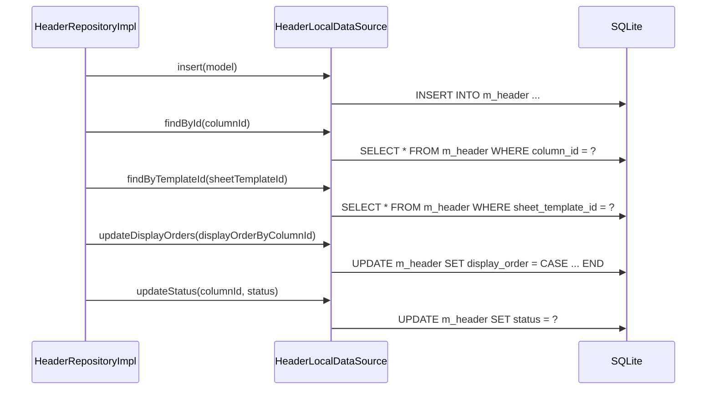

# HeaderLocalDataSource（header_local_datasource.dart）

| 新規作成・更新日 | 作成・更新者名 | 作成・更新内容 |
|---|---|---|
| 2026-09-25 | minamiyama | 新規作成 |

## 処理概要

`m_header`テーブルに対する実際のSQL実行を担うローカルデータソース。[HeaderRepositoryImpl](../repositories/header_repository_impl.md)から呼び出され、[HeaderModel](../models/header_model.md)を介してSQLiteの行とやり取りする。

## 処理シーケンス図



## insert

### 処理概要
新しい[HeaderModel](../models/header_model.md)を1件永続化する。

### input

| 項目論理名 | 項目物理名 | カプセルの型 | データ型 | バリデーション | 備考 |
|---|---|---|---|---|---|
| 列 | model | - | [HeaderModel](../models/header_model.md) | 必須 | - |

### output

| 項目論理名 | 項目物理名 | カプセルの型 | データ型 | 備考 |
|---|---|---|---|---|
| - | - | - | void | - |

### exception

なし

### 処理詳細
1. `model.toMap`で変換した`Map`を値としたINSERT文をDBに対して1回発行する。
   ```sql
   INSERT INTO m_header (column_id, sheet_template_id, type_id, name, display_order, is_priced, status, created_at, updated_at)
   VALUES (:columnId, :sheetTemplateId, :typeId, :name, :displayOrder, :isPriced, :status, :createdAt, :updatedAt);
   ```

## findById

### 処理概要
`columnId`に一致する有効な[HeaderModel](../models/header_model.md)を1件取得する。

### input

| 項目論理名 | 項目物理名 | カプセルの型 | データ型 | バリデーション | 備考 |
|---|---|---|---|---|---|
| 列ID | columnId | - | string | 必須 | - |

### output

| 項目論理名 | 項目物理名 | カプセルの型 | データ型 | 備考 |
|---|---|---|---|---|
| 列 | - | - | [HeaderModel](../models/header_model.md) | - |

### exception

| exception論理名 | exception物理名 | エラーコード | エラーメッセージ | 備考 |
|---|---|---|---|---|
| レコード未検出 | [RecordNotFoundException](../../../../core/errors/record_not_found_exception.md) | - | - | `entityName="Header"`, `id=columnId` |

### 処理詳細
1. 以下のSQLをDBに対して1回発行する。
   ```sql
   SELECT * FROM m_header WHERE column_id = :columnId AND status = 'active';
   ```
   条件a: 取得結果が0件の場合、`RecordNotFoundException`を送出し処理を終了する。
   条件b: 取得結果が1件の場合、次のステップへ進む。
2. 取得した1件を[HeaderModel.fromMap](../models/header_model.md)で変換して返却する。

## findByTemplateId

### 処理概要
`sheetTemplateId`に紐づく有効な[HeaderModel](../models/header_model.md)を`displayOrder`昇順で取得する。

### input

| 項目論理名 | 項目物理名 | カプセルの型 | データ型 | バリデーション | 備考 |
|---|---|---|---|---|---|
| 伝票フォーマットID | sheetTemplateId | - | string | 必須 | - |

### output

| 項目論理名 | 項目物理名 | カプセルの型 | データ型 | 備考 |
|---|---|---|---|---|
| 列一覧 | - | list | [HeaderModel](../models/header_model.md) | 該当なしの場合は空リスト |

### exception

なし

### 処理詳細
1. 以下のSQLをDBに対して1回発行する。
   ```sql
   SELECT * FROM m_header WHERE sheet_template_id = :sheetTemplateId AND status = 'active' ORDER BY display_order ASC;
   ```
2. 取得結果を[HeaderModel.fromMap](../models/header_model.md)でそれぞれ変換し、リストとして返却する。

## updateDisplayOrders

### 処理概要
複数の列の表示順を一括更新する。1件ずつループしてDBを呼び出すことを避けるため、単一のUPDATE文で全件を更新する。

### input

| 項目論理名 | 項目物理名 | カプセルの型 | データ型 | バリデーション | 備考 |
|---|---|---|---|---|---|
| 列IDと表示順の対応 | displayOrderByColumnId | map | string(key), int(value) | 必須, 1件以上 | key=columnId, value=displayOrder |

### output

| 項目論理名 | 項目物理名 | カプセルの型 | データ型 | 備考 |
|---|---|---|---|---|
| - | - | - | void | - |

### exception

なし

### 処理詳細
1. `displayOrderByColumnId`の各エントリから`WHEN column_id = :columnId THEN :displayOrder`句を組み立て、単一のCASE式によるUPDATE文を構築する（メモリ内処理、DBアクセスなし）。
2. 構築したSQLをDBに対して1回発行する（ループ内での個別DB呼び出しは行わない）。
   ```sql
   UPDATE m_header
   SET display_order = CASE column_id
       WHEN :columnId1 THEN :displayOrder1
       WHEN :columnId2 THEN :displayOrder2
       -- ...
   END,
   updated_at = :updatedAt
   WHERE column_id IN (:columnId1, :columnId2, ...);
   ```

## updateStatus

### 処理概要
指定した列の論理削除状態を更新する。

### input

| 項目論理名 | 項目物理名 | カプセルの型 | データ型 | バリデーション | 備考 |
|---|---|---|---|---|---|
| 列ID | columnId | - | string | 必須 | - |
| 論理削除状態 | status | - | [RecordStatus](../../domain/entities/enums/record_status.md) | 必須 | - |

### output

| 項目論理名 | 項目物理名 | カプセルの型 | データ型 | 備考 |
|---|---|---|---|---|
| - | - | - | void | - |

### exception

なし

### 処理詳細
1. 以下のSQLをDBに対して1回発行する。
   ```sql
   UPDATE m_header SET status = :status, updated_at = :updatedAt WHERE column_id = :columnId;
   ```
