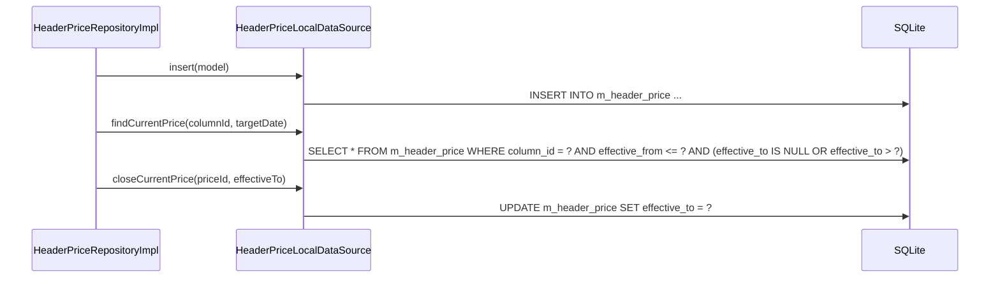

# HeaderPriceLocalDataSource（header_price_local_datasource.dart）

| 新規作成・更新日 | 作成・更新者名 | 作成・更新内容 |
|---|---|---|
| 2026-09-25 | minamiyama | 新規作成 |

## 処理概要

`m_header_price`テーブルに対する実際のSQL実行を担うローカルデータソース。[HeaderPriceRepositoryImpl](../repositories/header_price_repository_impl.md)から呼び出され、[HeaderPriceModel](../models/header_price_model.md)を介してSQLiteの行とやり取りする。

## 処理シーケンス図



## insert

### 処理概要
新しい[HeaderPriceModel](../models/header_price_model.md)を1件永続化する。

### input

| 項目論理名 | 項目物理名 | カプセルの型 | データ型 | バリデーション | 備考 |
|---|---|---|---|---|---|
| 単価改定履歴 | model | - | [HeaderPriceModel](../models/header_price_model.md) | 必須 | - |

### output

| 項目論理名 | 項目物理名 | カプセルの型 | データ型 | 備考 |
|---|---|---|---|---|
| - | - | - | void | - |

### exception

なし

### 処理詳細
1. `model.toMap`で変換した`Map`を値としたINSERT文をDBに対して1回発行する。
   ```sql
   INSERT INTO m_header_price (price_id, column_id, price, effective_from, effective_to, created_at, updated_at)
   VALUES (:priceId, :columnId, :price, :effectiveFrom, :effectiveTo, :createdAt, :updatedAt);
   ```

## findCurrentPrice

### 処理概要
指定した列(`columnId`)について、指定日(`targetDate`)時点で有効な単価を1件取得する。[db_schema.md](../../../../../../../requried/db_schema.md) §5.4の取得例に対応する。

### input

| 項目論理名 | 項目物理名 | カプセルの型 | データ型 | バリデーション | 備考 |
|---|---|---|---|---|---|
| 列ID | columnId | - | string | 必須 | - |
| 対象日 | targetDate | - | DateTime | 必須, 日付のみ | - |

### output

| 項目論理名 | 項目物理名 | カプセルの型 | データ型 | 備考 |
|---|---|---|---|---|
| 単価改定履歴 | - | - | [HeaderPriceModel](../models/header_price_model.md) | 対象日時点で有効な1件 |

### exception

| exception論理名 | exception物理名 | エラーコード | エラーメッセージ | 備考 |
|---|---|---|---|---|
| レコード未検出 | [RecordNotFoundException](../../../../core/errors/record_not_found_exception.md) | - | - | `entityName="HeaderPrice"`, `id=columnId`。対象日時点で有効な単価が1件も登録されていない場合 |

### 処理詳細
1. 以下のSQLをDBに対して1回発行する。
   ```sql
   SELECT * FROM m_header_price
   WHERE column_id = :columnId
     AND effective_from <= :targetDate
     AND (effective_to IS NULL OR effective_to > :targetDate)
   ORDER BY effective_from DESC LIMIT 1;
   ```
   条件a: 取得結果が0件の場合、`RecordNotFoundException`を送出し処理を終了する。\
   条件b: 取得結果が1件の場合、次のステップへ進む。
2. 取得した1件を[HeaderPriceModel.fromMap](../models/header_price_model.md)で変換して返却する。

## closeCurrentPrice

### 処理概要
既存の単価改定履歴の適用終了日を更新し、有効期間を終了させる。

### input

| 項目論理名 | 項目物理名 | カプセルの型 | データ型 | バリデーション | 備考 |
|---|---|---|---|---|---|
| 価格ID | priceId | - | string | 必須 | - |
| 適用終了日 | effectiveTo | - | DateTime | 必須, 日付のみ | - |

### output

| 項目論理名 | 項目物理名 | カプセルの型 | データ型 | 備考 |
|---|---|---|---|---|
| - | - | - | void | - |

### exception

なし

### 処理詳細
1. 以下のSQLをDBに対して1回発行する。
   ```sql
   UPDATE m_header_price SET effective_to = :effectiveTo, updated_at = :updatedAt WHERE price_id = :priceId;
   ```
