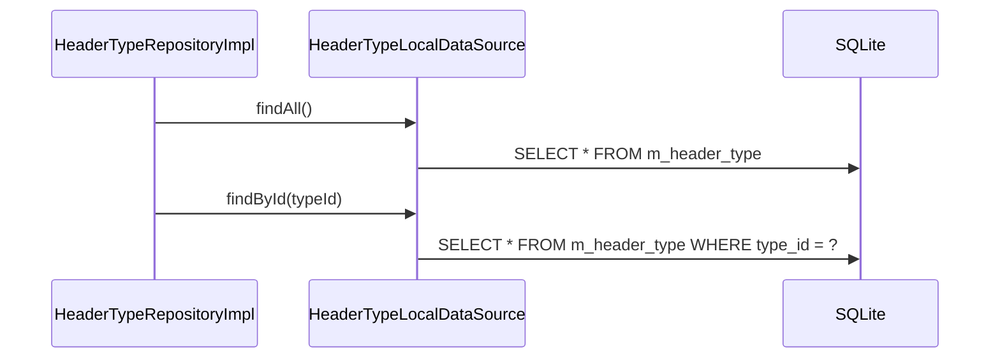

# HeaderTypeLocalDataSource（header_type_local_datasource.dart）

| 新規作成・更新日 | 作成・更新者名 | 作成・更新内容 |
|---|---|---|
| 2026-09-25 | minamiyama | 新規作成 |

## 処理概要

`m_header_type`テーブル（固定小規模マスタ）に対する実際のSQL実行を担うローカルデータソース。書き込みはアプリ初期化時のシードデータ投入のみのため、検索系メソッドのみを提供する。[HeaderTypeRepositoryImpl](../repositories/header_type_repository_impl.md)から呼び出される。

## 処理シーケンス図



## findAll

### 処理概要
[HeaderTypeModel](../models/header_type_model.md)を`typeId`昇順で全件取得する。

### input

なし

### output

| 項目論理名 | 項目物理名 | カプセルの型 | データ型 | 備考 |
|---|---|---|---|---|
| 型一覧 | - | list | [HeaderTypeModel](../models/header_type_model.md) | 固定5件 |

### exception

なし

### 処理詳細
1. 以下のSQLをDBに対して1回発行する。
   ```sql
   SELECT * FROM m_header_type ORDER BY type_id ASC;
   ```
2. 取得結果を[HeaderTypeModel.fromMap](../models/header_type_model.md)でそれぞれ変換し、リストとして返却する。

## findById

### 処理概要
`typeId`に一致する[HeaderTypeModel](../models/header_type_model.md)を1件取得する。

### input

| 項目論理名 | 項目物理名 | カプセルの型 | データ型 | バリデーション | 備考 |
|---|---|---|---|---|---|
| 型ID | typeId | - | int | 必須 | - |

### output

| 項目論理名 | 項目物理名 | カプセルの型 | データ型 | 備考 |
|---|---|---|---|---|
| 型 | - | - | [HeaderTypeModel](../models/header_type_model.md) | - |

### exception

| exception論理名 | exception物理名 | エラーコード | エラーメッセージ | 備考 |
|---|---|---|---|---|
| レコード未検出 | [RecordNotFoundException](../../../../core/errors/record_not_found_exception.md) | - | - | `entityName="HeaderType"`, `id=typeId.toString()` |

### 処理詳細
1. 以下のSQLをDBに対して1回発行する。
   ```sql
   SELECT * FROM m_header_type WHERE type_id = :typeId;
   ```
   条件a: 取得結果が0件の場合、`RecordNotFoundException`を送出し処理を終了する。
   条件b: 取得結果が1件の場合、次のステップへ進む。
2. 取得した1件を[HeaderTypeModel.fromMap](../models/header_type_model.md)で変換して返却する。
