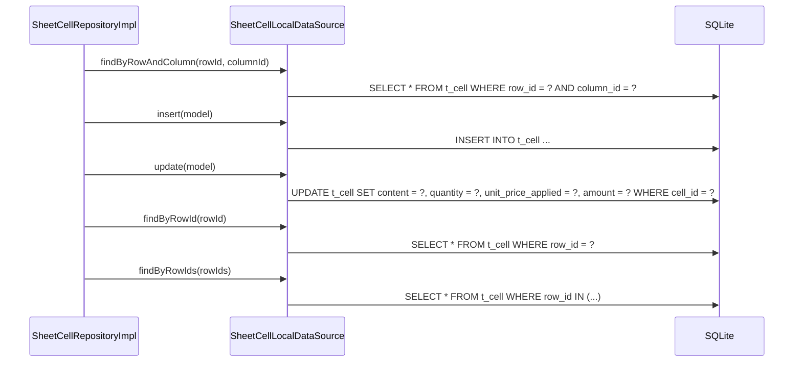

# SheetCellLocalDataSource（sheet_cell_local_datasource.dart）

| 新規作成・更新日 | 作成・更新者名 | 作成・更新内容 |
|---|---|---|
| 2026-09-25 | minamiyama | 新規作成 |

## 処理概要

`t_cell`テーブルに対する実際のSQL実行を担うローカルデータソース。[SheetCellRepositoryImpl](../repositories/sheet_cell_repository_impl.md)から呼び出され、[SheetCellModel](../models/sheet_cell_model.md)を介してSQLiteの行とやり取りする。

## 処理シーケンス図



## findByRowAndColumn

### 処理概要
`rowId`と`columnId`の組に一致する[SheetCellModel](../models/sheet_cell_model.md)を1件取得する。セル入力時に新規作成・更新のどちらを行うか判定するために使用するため、未検出時は例外ではなく`null`を返す。

### input

| 項目論理名 | 項目物理名 | カプセルの型 | データ型 | バリデーション | 備考 |
|---|---|---|---|---|---|
| 行ID | rowId | - | string | 必須 | - |
| 列ID | columnId | - | string | 必須 | - |

### output

| 項目論理名 | 項目物理名 | カプセルの型 | データ型 | 備考 |
|---|---|---|---|---|
| セル | - | optional | [SheetCellModel](../models/sheet_cell_model.md) | 未入力の場合は`null` |

### exception

なし

### 処理詳細
1. 以下のSQLをDBに対して1回発行する。
   ```sql
   SELECT * FROM t_cell WHERE row_id = :rowId AND column_id = :columnId;
   ```
   条件a: 取得結果が0件の場合、`null`を返却し処理を終了する。\
   条件b: 取得結果が1件の場合、次のステップへ進む。
2. 取得した1件を[SheetCellModel.fromMap](../models/sheet_cell_model.md)で変換して返却する。

## insert

### 処理概要
新しい[SheetCellModel](../models/sheet_cell_model.md)を1件永続化する。

### input

| 項目論理名 | 項目物理名 | カプセルの型 | データ型 | バリデーション | 備考 |
|---|---|---|---|---|---|
| セル | model | - | [SheetCellModel](../models/sheet_cell_model.md) | 必須 | - |

### output

| 項目論理名 | 項目物理名 | カプセルの型 | データ型 | 備考 |
|---|---|---|---|---|
| - | - | - | void | - |

### exception

なし

### 処理詳細
1. `model.toMap`で変換した`Map`を値としたINSERT文をDBに対して1回発行する。
   ```sql
   INSERT INTO t_cell (cell_id, row_id, column_id, content, quantity, unit_price_applied, amount, created_at, updated_at)
   VALUES (:cellId, :rowId, :columnId, :content, :quantity, :unitPriceApplied, :amount, :createdAt, :updatedAt);
   ```

## update

### 処理概要
既存の[SheetCellModel](../models/sheet_cell_model.md)の値を更新する。

### input

| 項目論理名 | 項目物理名 | カプセルの型 | データ型 | バリデーション | 備考 |
|---|---|---|---|---|---|
| セル | model | - | [SheetCellModel](../models/sheet_cell_model.md) | 必須, `cellId`が既存レコードと一致すること | - |

### output

| 項目論理名 | 項目物理名 | カプセルの型 | データ型 | 備考 |
|---|---|---|---|---|
| - | - | - | void | - |

### exception

なし

### 処理詳細
1. 以下のSQLをDBに対して1回発行する。
   ```sql
   UPDATE t_cell
   SET content = :content, quantity = :quantity, unit_price_applied = :unitPriceApplied, amount = :amount, updated_at = :updatedAt
   WHERE cell_id = :cellId;
   ```

## findByRowId

### 処理概要
`rowId`に紐づく[SheetCellModel](../models/sheet_cell_model.md)を全件取得する。

### input

| 項目論理名 | 項目物理名 | カプセルの型 | データ型 | バリデーション | 備考 |
|---|---|---|---|---|---|
| 行ID | rowId | - | string | 必須 | - |

### output

| 項目論理名 | 項目物理名 | カプセルの型 | データ型 | 備考 |
|---|---|---|---|---|
| セル一覧 | - | list | [SheetCellModel](../models/sheet_cell_model.md) | 該当なしの場合は空リスト |

### exception

なし

### 処理詳細
1. 以下のSQLをDBに対して1回発行する。
   ```sql
   SELECT * FROM t_cell WHERE row_id = :rowId;
   ```
2. 取得結果を[SheetCellModel.fromMap](../models/sheet_cell_model.md)でそれぞれ変換し、リストとして返却する。

## findByRowIds

### 処理概要
複数の`rowId`に紐づく[SheetCellModel](../models/sheet_cell_model.md)を一括取得する。CSV出力（[ExportDailySheetToCsvUsecase](../../domain/usecases/export_daily_sheet_to_csv_usecase.md)）のように複数行分のセルが必要な場合に、行ごとにループしてDBを呼び出すことを避けるため使用する。

### input

| 項目論理名 | 項目物理名 | カプセルの型 | データ型 | バリデーション | 備考 |
|---|---|---|---|---|---|
| 行IDリスト | rowIds | list | string | 必須, 1件以上 | - |

### output

| 項目論理名 | 項目物理名 | カプセルの型 | データ型 | 備考 |
|---|---|---|---|---|
| セル一覧 | - | list | [SheetCellModel](../models/sheet_cell_model.md) | 該当なしの場合は空リスト |

### exception

なし

### 処理詳細
1. `rowIds`を`IN`句のプレースホルダに展開したSQLをDBに対して1回発行する。
   ```sql
   SELECT * FROM t_cell WHERE row_id IN (:rowId1, :rowId2, ...);
   ```
2. 取得結果を[SheetCellModel.fromMap](../models/sheet_cell_model.md)でそれぞれ変換し、リストとして返却する。
