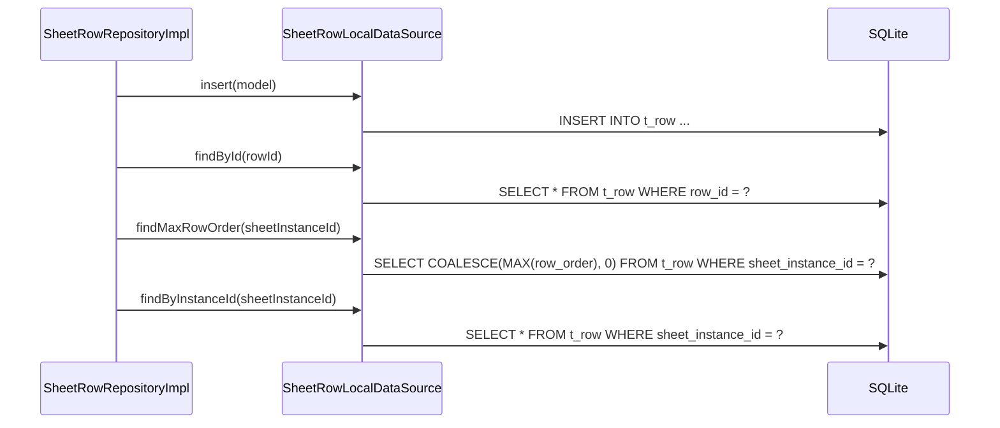

# SheetRowLocalDataSource（sheet_row_local_datasource.dart）

| 新規作成・更新日 | 作成・更新者名 | 作成・更新内容 |
|---|---|---|
| 2026-09-25 | minamiyama | 新規作成 |

## 処理概要

`t_row`テーブルに対する実際のSQL実行を担うローカルデータソース。[SheetRowRepositoryImpl](../repositories/sheet_row_repository_impl.md)から呼び出され、[SheetRowModel](../models/sheet_row_model.md)を介してSQLiteの行とやり取りする。`total_amount`はDBトリガー（[db_schema.md](../../../../../../../requried/db_schema.md) §7 `trg_t_cell_ai/au/ad`）により[SheetCell](../../domain/entities/sheet_cell.md)の変更に追従して自動更新されるため、本データソースに更新用メソッドは設けない。

## 処理シーケンス図



## insert

### 処理概要
新しい[SheetRowModel](../models/sheet_row_model.md)を1件永続化する。

### input

| 項目論理名 | 項目物理名 | カプセルの型 | データ型 | バリデーション | 備考 |
|---|---|---|---|---|---|
| 行 | model | - | [SheetRowModel](../models/sheet_row_model.md) | 必須 | - |

### output

| 項目論理名 | 項目物理名 | カプセルの型 | データ型 | 備考 |
|---|---|---|---|---|
| - | - | - | void | - |

### exception

なし

### 処理詳細
1. `model.toMap`で変換した`Map`を値としたINSERT文をDBに対して1回発行する。
   ```sql
   INSERT INTO t_row (row_id, sheet_instance_id, customer_id, staff_id, row_order, total_amount, status, created_at, updated_at)
   VALUES (:rowId, :sheetInstanceId, :customerId, :staffId, :rowOrder, :totalAmount, :status, :createdAt, :updatedAt);
   ```

## findById

### 処理概要
`rowId`に一致する有効な[SheetRowModel](../models/sheet_row_model.md)を1件取得する。

### input

| 項目論理名 | 項目物理名 | カプセルの型 | データ型 | バリデーション | 備考 |
|---|---|---|---|---|---|
| 行ID | rowId | - | string | 必須 | - |

### output

| 項目論理名 | 項目物理名 | カプセルの型 | データ型 | 備考 |
|---|---|---|---|---|
| 行 | - | - | [SheetRowModel](../models/sheet_row_model.md) | - |

### exception

| exception論理名 | exception物理名 | エラーコード | エラーメッセージ | 備考 |
|---|---|---|---|---|
| レコード未検出 | [RecordNotFoundException](../../../../core/errors/record_not_found_exception.md) | - | - | `entityName="SheetRow"`, `id=rowId` |

### 処理詳細
1. 以下のSQLをDBに対して1回発行する。
   ```sql
   SELECT * FROM t_row WHERE row_id = :rowId AND status = 'active';
   ```
   条件a: 取得結果が0件の場合、`RecordNotFoundException`を送出し処理を終了する。\
   条件b: 取得結果が1件の場合、次のステップへ進む。
2. 取得した1件を[SheetRowModel.fromMap](../models/sheet_row_model.md)で変換して返却する。

## findMaxRowOrder

### 処理概要
指定した伝票インスタンス内での現在の最大表示順を取得する。行が1件も存在しない場合は0を返す。

### input

| 項目論理名 | 項目物理名 | カプセルの型 | データ型 | バリデーション | 備考 |
|---|---|---|---|---|---|
| 伝票インスタンスID | sheetInstanceId | - | string | 必須 | - |

### output

| 項目論理名 | 項目物理名 | カプセルの型 | データ型 | 備考 |
|---|---|---|---|---|
| 最大表示順 | - | - | int | 該当行なしの場合は0 |

### exception

なし

### 処理詳細
1. 以下のSQLをDBに対して1回発行する。
   ```sql
   SELECT COALESCE(MAX(row_order), 0) AS max_row_order
   FROM t_row WHERE sheet_instance_id = :sheetInstanceId AND status = 'active';
   ```
2. 取得した値をintとして返却する。

## findByInstanceId

### 処理概要
`sheetInstanceId`に紐づく有効な[SheetRowModel](../models/sheet_row_model.md)を`rowOrder`昇順で取得する。

### input

| 項目論理名 | 項目物理名 | カプセルの型 | データ型 | バリデーション | 備考 |
|---|---|---|---|---|---|
| 伝票インスタンスID | sheetInstanceId | - | string | 必須 | - |

### output

| 項目論理名 | 項目物理名 | カプセルの型 | データ型 | 備考 |
|---|---|---|---|---|
| 行一覧 | - | list | [SheetRowModel](../models/sheet_row_model.md) | 該当なしの場合は空リスト |

### exception

なし

### 処理詳細
1. 以下のSQLをDBに対して1回発行する。
   ```sql
   SELECT * FROM t_row WHERE sheet_instance_id = :sheetInstanceId AND status = 'active' ORDER BY row_order ASC;
   ```
2. 取得結果を[SheetRowModel.fromMap](../models/sheet_row_model.md)でそれぞれ変換し、リストとして返却する。
