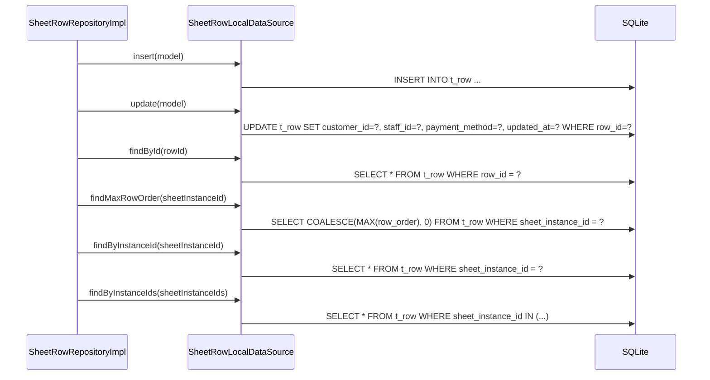

# SheetRowLocalDataSource（sheet_row_local_datasource.dart）

| 新規作成・更新日 | 作成・更新者名 | 作成・更新内容 |
|---|---|---|
| 2026-09-25 | minamiyama | 新規作成 |
| 2026-09-27 | minamiyama | `insert`に`payment_method`カラムを追加。`update`を追加（お名前・担当・決済方法の後からの変更に対応） |
| 2026-09-29 | minamiyama | `findByInstanceIds`を追加（複数営業日分の一括取得、FR-3） |

## 処理概要

`t_row`テーブルに対する実際のSQL実行を担うローカルデータソース。[SheetRowRepositoryImpl](../repositories/sheet_row_repository_impl.md)から呼び出され、[SheetRowModel](../models/sheet_row_model.md)を介してSQLiteの行とやり取りする。`total_amount`はDBトリガー（[db_schema.md](../../../../../../../requried/db_schema.md) §7 `trg_t_cell_ai/au/ad`）により[SheetCell](../../domain/entities/sheet_cell.md)の変更に追従して自動更新されるため、`update`の対象には含めない。

## 処理シーケンス図


```mermaid
sequenceDiagram
    participant R as SheetRowRepositoryImpl
    participant D as SheetRowLocalDataSource
    participant DB as SQLite

    R->>D: insert(model)
    D->>DB: INSERT INTO t_row ...
    R->>D: update(model)
    D->>DB: UPDATE t_row SET customer_id=?, staff_id=?, payment_method=?, updated_at=? WHERE row_id=?
    R->>D: findById(rowId)
    D->>DB: SELECT * FROM t_row WHERE row_id = ?
    R->>D: findMaxRowOrder(sheetInstanceId)
    D->>DB: SELECT COALESCE(MAX(row_order), 0) FROM t_row WHERE sheet_instance_id = ?
    R->>D: findByInstanceId(sheetInstanceId)
    D->>DB: SELECT * FROM t_row WHERE sheet_instance_id = ?
    R->>D: findByInstanceIds(sheetInstanceIds)
    D->>DB: SELECT * FROM t_row WHERE sheet_instance_id IN (...)
```

## insert

### 処理概要
新しい[SheetRowModel](../models/sheet_row_model.md)を1件永続化する。

### input

| 項目論理名 | 項目物理名 | カプセルの型 | データ型 | バリデーション | 備考 |
|---|---|---|---|---|---|
| 行 | model | - | [SheetRowModel](../models/sheet_row_model.md) | 必須 | - |

### output

| 項目論理名 | 項目物理名 | カプセルの型 | データ型 | 備考 |
|---|---|---|---|---|
| - | - | - | void | - |

### exception

なし

### 処理詳細
1. `model.toMap`で変換した`Map`を値としたINSERT文をDBに対して1回発行する。
   ```sql
   INSERT INTO t_row (row_id, sheet_instance_id, customer_id, staff_id, row_order, total_amount, payment_method, status, created_at, updated_at)
   VALUES (:rowId, :sheetInstanceId, :customerId, :staffId, :rowOrder, :totalAmount, :paymentMethod, :status, :createdAt, :updatedAt);
   ```

## update

### 処理概要
既存の[SheetRowModel](../models/sheet_row_model.md)の`customer_id`・`staff_id`・`payment_method`を上書きする。

### input

| 項目論理名 | 項目物理名 | カプセルの型 | データ型 | バリデーション | 備考 |
|---|---|---|---|---|---|
| 行 | model | - | [SheetRowModel](../models/sheet_row_model.md) | 必須 | - |

### output

| 項目論理名 | 項目物理名 | カプセルの型 | データ型 | 備考 |
|---|---|---|---|---|
| - | - | - | void | - |

### exception

| exception論理名 | exception物理名 | エラーコード | エラーメッセージ | 備考 |
|---|---|---|---|---|
| レコード未検出 | [RecordNotFoundException](../../../../core/errors/record_not_found_exception.md) | - | - | 対象の`row_id`が存在しない場合（UPDATE文の影響行数が0件） |

### 処理詳細
1. 以下のSQLをDBに対して1回発行する。
   ```sql
   UPDATE t_row
   SET customer_id = :customerId, staff_id = :staffId, payment_method = :paymentMethod, updated_at = :updatedAt
   WHERE row_id = :rowId AND status = 'active';
   ```
   条件a: 影響行数が0件の場合、`RecordNotFoundException`を送出する。\
   条件b: 影響行数が1件の場合、正常終了とする。

## findById

### 処理概要
`rowId`に一致する有効な[SheetRowModel](../models/sheet_row_model.md)を1件取得する。

### input

| 項目論理名 | 項目物理名 | カプセルの型 | データ型 | バリデーション | 備考 |
|---|---|---|---|---|---|
| 行ID | rowId | - | string | 必須 | - |

### output

| 項目論理名 | 項目物理名 | カプセルの型 | データ型 | 備考 |
|---|---|---|---|---|
| 行 | - | - | [SheetRowModel](../models/sheet_row_model.md) | - |

### exception

| exception論理名 | exception物理名 | エラーコード | エラーメッセージ | 備考 |
|---|---|---|---|---|
| レコード未検出 | [RecordNotFoundException](../../../../core/errors/record_not_found_exception.md) | - | - | `entityName="SheetRow"`, `id=rowId` |

### 処理詳細
1. 以下のSQLをDBに対して1回発行する。
   ```sql
   SELECT * FROM t_row WHERE row_id = :rowId AND status = 'active';
   ```
   条件a: 取得結果が0件の場合、`RecordNotFoundException`を送出し処理を終了する。\
   条件b: 取得結果が1件の場合、次のステップへ進む。
2. 取得した1件を[SheetRowModel.fromMap](../models/sheet_row_model.md)で変換して返却する。

## findMaxRowOrder

### 処理概要
指定した伝票インスタンス内での現在の最大表示順を取得する。行が1件も存在しない場合は0を返す。

### input

| 項目論理名 | 項目物理名 | カプセルの型 | データ型 | バリデーション | 備考 |
|---|---|---|---|---|---|
| 伝票インスタンスID | sheetInstanceId | - | string | 必須 | - |

### output

| 項目論理名 | 項目物理名 | カプセルの型 | データ型 | 備考 |
|---|---|---|---|---|
| 最大表示順 | - | - | int | 該当行なしの場合は0 |

### exception

なし

### 処理詳細
1. 以下のSQLをDBに対して1回発行する。
   ```sql
   SELECT COALESCE(MAX(row_order), 0) AS max_row_order
   FROM t_row WHERE sheet_instance_id = :sheetInstanceId AND status = 'active';
   ```
2. 取得した値をintとして返却する。

## findByInstanceId

### 処理概要
`sheetInstanceId`に紐づく有効な[SheetRowModel](../models/sheet_row_model.md)を`rowOrder`昇順で取得する。

### input

| 項目論理名 | 項目物理名 | カプセルの型 | データ型 | バリデーション | 備考 |
|---|---|---|---|---|---|
| 伝票インスタンスID | sheetInstanceId | - | string | 必須 | - |

### output

| 項目論理名 | 項目物理名 | カプセルの型 | データ型 | 備考 |
|---|---|---|---|---|
| 行一覧 | - | list | [SheetRowModel](../models/sheet_row_model.md) | 該当なしの場合は空リスト |

### exception

なし

### 処理詳細
1. 以下のSQLをDBに対して1回発行する。
   ```sql
   SELECT * FROM t_row WHERE sheet_instance_id = :sheetInstanceId AND status = 'active' ORDER BY row_order ASC;
   ```
2. 取得結果を[SheetRowModel.fromMap](../models/sheet_row_model.md)でそれぞれ変換し、リストとして返却する。

## findByInstanceIds

### 処理概要
複数の`sheetInstanceIds`に紐づく有効な[SheetRowModel](../models/sheet_row_model.md)を`sheet_instance_id`・`row_order`昇順で一括取得する。伝票インスタンス数分ループしてDBを呼び出すことを避けるため、`IN`句による単一のSELECT文で全件を取得する（CSV期間出力、FR-3）。

### input

| 項目論理名 | 項目物理名 | カプセルの型 | データ型 | バリデーション | 備考 |
|---|---|---|---|---|---|
| 伝票インスタンスID一覧 | sheetInstanceIds | list | string | 必須 | 空リストの場合はSQL発行前に空リストを返却する |

### output

| 項目論理名 | 項目物理名 | カプセルの型 | データ型 | 備考 |
|---|---|---|---|---|
| 行一覧 | - | list | [SheetRowModel](../models/sheet_row_model.md) | 該当なしの場合は空リスト |

### exception

なし

### 処理詳細
1. 条件a: `sheetInstanceIds`が空リストの場合、空リストを返却し処理を終了する。\
   条件b: 1件以上の場合、次のステップへ進む。
2. `sheetInstanceIds`の件数分のプレースホルダ（`?`）を`IN`句として組み立てる（メモリ内処理、DBアクセスなし）。
3. 以下のSQLをDBに対して1回発行する。
   ```sql
   SELECT * FROM t_row
   WHERE sheet_instance_id IN (:sheetInstanceId1, :sheetInstanceId2, ...) AND status = 'active'
   ORDER BY sheet_instance_id ASC, row_order ASC;
   ```
4. 取得結果を[SheetRowModel.fromMap](../models/sheet_row_model.md)でそれぞれ変換し、リストとして返却する。
