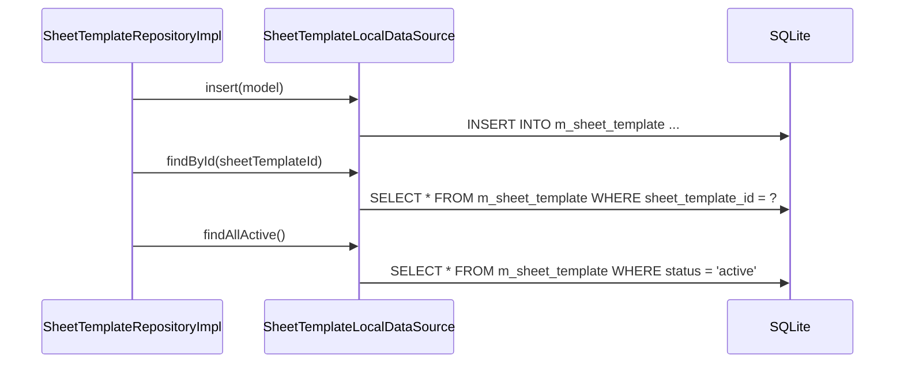

# SheetTemplateLocalDataSource（sheet_template_local_datasource.dart）

| 新規作成・更新日 | 作成・更新者名 | 作成・更新内容 |
|---|---|---|
| 2026-09-25 | minamiyama | 新規作成 |

## 処理概要

`m_sheet_template`テーブルに対する実際のSQL実行を担うローカルデータソース。[SheetTemplateRepositoryImpl](../repositories/sheet_template_repository_impl.md)から呼び出され、[SheetTemplateModel](../models/sheet_template_model.md)を介してSQLiteの行とやり取りする。

## 処理シーケンス図



## insert

### 処理概要
新しい[SheetTemplateModel](../models/sheet_template_model.md)を1件永続化する。

### input

| 項目論理名 | 項目物理名 | カプセルの型 | データ型 | バリデーション | 備考 |
|---|---|---|---|---|---|
| 伝票フォーマット | model | - | [SheetTemplateModel](../models/sheet_template_model.md) | 必須 | - |

### output

| 項目論理名 | 項目物理名 | カプセルの型 | データ型 | 備考 |
|---|---|---|---|---|
| - | - | - | void | - |

### exception

なし

### 処理詳細
1. `model.toMap`で変換した`Map`を値としたINSERT文をDBに対して1回発行する。
   ```sql
   INSERT INTO m_sheet_template (sheet_template_id, name, status, created_at, updated_at)
   VALUES (:sheetTemplateId, :name, :status, :createdAt, :updatedAt);
   ```

## findById

### 処理概要
`sheetTemplateId`に一致する有効な[SheetTemplateModel](../models/sheet_template_model.md)を1件取得する。

### input

| 項目論理名 | 項目物理名 | カプセルの型 | データ型 | バリデーション | 備考 |
|---|---|---|---|---|---|
| 伝票フォーマットID | sheetTemplateId | - | string | 必須 | - |

### output

| 項目論理名 | 項目物理名 | カプセルの型 | データ型 | 備考 |
|---|---|---|---|---|
| 伝票フォーマット | - | - | [SheetTemplateModel](../models/sheet_template_model.md) | - |

### exception

| exception論理名 | exception物理名 | エラーコード | エラーメッセージ | 備考 |
|---|---|---|---|---|
| レコード未検出 | [RecordNotFoundException](../../../../core/errors/record_not_found_exception.md) | - | - | `entityName="SheetTemplate"`, `id=sheetTemplateId` |

### 処理詳細
1. 以下のSQLをDBに対して1回発行する。
   ```sql
   SELECT * FROM m_sheet_template WHERE sheet_template_id = :sheetTemplateId AND status = 'active';
   ```
   条件a: 取得結果が0件の場合、`RecordNotFoundException`を送出し処理を終了する。\
   条件b: 取得結果が1件の場合、次のステップへ進む。
2. 取得した1件を[SheetTemplateModel.fromMap](../models/sheet_template_model.md)で変換して返却する。

## findAllActive

### 処理概要
論理削除されていない[SheetTemplateModel](../models/sheet_template_model.md)を作成日時の昇順で全件取得する。

### input

なし

### output

| 項目論理名 | 項目物理名 | カプセルの型 | データ型 | 備考 |
|---|---|---|---|---|
| 伝票フォーマット一覧 | - | list | [SheetTemplateModel](../models/sheet_template_model.md) | 該当なしの場合は空リスト |

### exception

なし

### 処理詳細
1. 以下のSQLをDBに対して1回発行する。
   ```sql
   SELECT * FROM m_sheet_template WHERE status = 'active' ORDER BY created_at ASC;
   ```
2. 取得結果を[SheetTemplateModel.fromMap](../models/sheet_template_model.md)でそれぞれ変換し、リストとして返却する。
