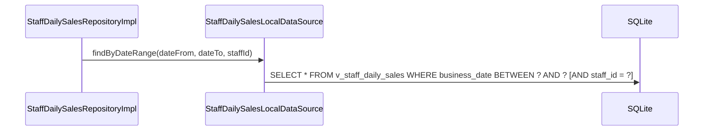

# StaffDailySalesLocalDataSource（staff_daily_sales_local_datasource.dart）

| 新規作成・更新日 | 作成・更新者名 | 作成・更新内容 |
|---|---|---|
| 2026-09-25 | minamiyama | 新規作成 |

## 処理概要

ビュー`v_staff_daily_sales`（[db_schema.md](../../../../../../../requried/db_schema.md) §6）を参照し、[StaffDailySalesModel](../models/staff_daily_sales_model.md)を取得する読み取り専用のデータソース。ビューを参照するため永続化系メソッドは持たない。[StaffDailySalesRepositoryImpl](../repositories/staff_daily_sales_repository_impl.md)から呼び出される。

## 処理シーケンス図



## findByDateRange

### 処理概要
指定した営業日の範囲（`dateFrom`〜`dateTo`）に該当する[StaffDailySalesModel](../models/staff_daily_sales_model.md)を取得する。`staffId`を指定した場合は該当スタッフのみに絞り込む。

### input

| 項目論理名 | 項目物理名 | カプセルの型 | データ型 | バリデーション | 備考 |
|---|---|---|---|---|---|
| 営業日(開始) | dateFrom | - | DateTime | 必須, 日付のみ | - |
| 営業日(終了) | dateTo | - | DateTime | 必須, 日付のみ, `dateFrom`以降 | - |
| スタッフID | staffId | optional | string | 任意 | 指定時は絞り込み条件に追加する |

### output

| 項目論理名 | 項目物理名 | カプセルの型 | データ型 | 備考 |
|---|---|---|---|---|
| スタッフ別日別売上一覧 | - | list | [StaffDailySalesModel](../models/staff_daily_sales_model.md) | 該当なしの場合は空リスト |

### exception

なし

### 処理詳細
1. 条件a: `staffId`が指定されている場合、以下のSQLをDBに対して1回発行する。
   ```sql
   SELECT * FROM v_staff_daily_sales
   WHERE business_date BETWEEN :dateFrom AND :dateTo AND staff_id = :staffId
   ORDER BY business_date ASC, staff_id ASC;
   ```
   条件b: `staffId`が指定されていない場合、以下のSQLをDBに対して1回発行する。
   ```sql
   SELECT * FROM v_staff_daily_sales
   WHERE business_date BETWEEN :dateFrom AND :dateTo
   ORDER BY business_date ASC, staff_id ASC;
   ```
2. 取得結果を[StaffDailySalesModel.fromMap](../models/staff_daily_sales_model.md)でそれぞれ変換し、リストとして返却する。
