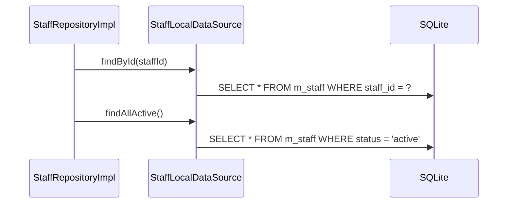

# StaffLocalDataSource（staff_local_datasource.dart）

| 新規作成・更新日 | 作成・更新者名 | 作成・更新内容 |
|---|---|---|
| 2026-09-25 | minamiyama | 新規作成 |

## 処理概要

`m_staff`テーブルに対する実際のSQL実行を担うローカルデータソース。[StaffRepositoryImpl](../repositories/staff_repository_impl.md)から呼び出され、[StaffModel](../models/staff_model.md)を介してSQLiteの行とやり取りする。

## 処理シーケンス図



## findById

### 処理概要
`staffId`に一致する有効な[StaffModel](../models/staff_model.md)を1件取得する。

### input

| 項目論理名 | 項目物理名 | カプセルの型 | データ型 | バリデーション | 備考 |
|---|---|---|---|---|---|
| スタッフID | staffId | - | string | 必須 | - |

### output

| 項目論理名 | 項目物理名 | カプセルの型 | データ型 | 備考 |
|---|---|---|---|---|
| スタッフ | - | - | [StaffModel](../models/staff_model.md) | - |

### exception

| exception論理名 | exception物理名 | エラーコード | エラーメッセージ | 備考 |
|---|---|---|---|---|
| レコード未検出 | [RecordNotFoundException](../../../../core/errors/record_not_found_exception.md) | - | - | `entityName="Staff"`, `id=staffId` |

### 処理詳細
1. 以下のSQLをDBに対して1回発行する。
   ```sql
   SELECT * FROM m_staff WHERE staff_id = :staffId AND status = 'active';
   ```
   条件a: 取得結果が0件の場合、`RecordNotFoundException`を送出し処理を終了する。\
   条件b: 取得結果が1件の場合、次のステップへ進む。
2. 取得した1件を[StaffModel.fromMap](../models/staff_model.md)で変換して返却する。

## findAllActive

### 処理概要
論理削除されていない[StaffModel](../models/staff_model.md)を全件取得する。

### input

なし

### output

| 項目論理名 | 項目物理名 | カプセルの型 | データ型 | 備考 |
|---|---|---|---|---|
| スタッフ一覧 | - | list | [StaffModel](../models/staff_model.md) | 該当なしの場合は空リスト |

### exception

なし

### 処理詳細
1. 以下のSQLをDBに対して1回発行する。
   ```sql
   SELECT * FROM m_staff WHERE status = 'active' ORDER BY name ASC;
   ```
2. 取得結果を[StaffModel.fromMap](../models/staff_model.md)でそれぞれ変換し、リストとして返却する。
