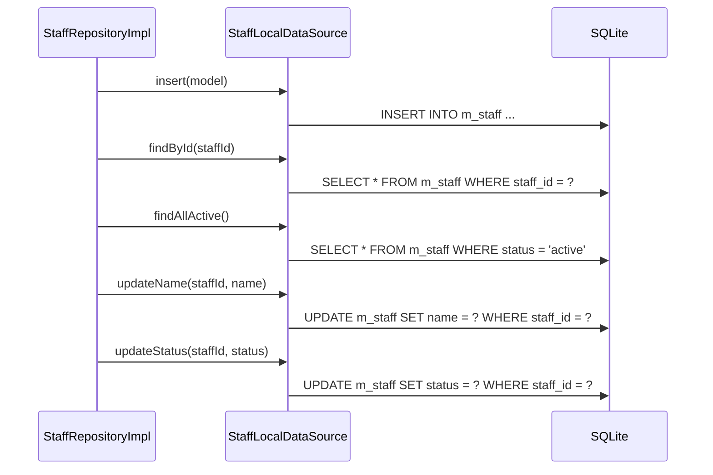

# StaffLocalDataSource（staff_local_datasource.dart）

| 新規作成・更新日 | 作成・更新者名 | 作成・更新内容 |
|---|---|---|
| 2026-09-25 | minamiyama | 新規作成 |
| 2026-09-29 | minamiyama | `insert`・`updateName`・`updateStatus`を追加（FR-7） |

## 処理概要

`m_staff`テーブルに対する実際のSQL実行を担うローカルデータソース。[StaffRepositoryImpl](../repositories/staff_repository_impl.md)から呼び出され、[StaffModel](../models/staff_model.md)を介してSQLiteの行とやり取りする。

## 処理シーケンス図


```mermaid
sequenceDiagram
    participant R as StaffRepositoryImpl
    participant D as StaffLocalDataSource
    participant DB as SQLite

    R->>D: insert(model)
    D->>DB: INSERT INTO m_staff ...
    R->>D: findById(staffId)
    D->>DB: SELECT * FROM m_staff WHERE staff_id = ?
    R->>D: findAllActive()
    D->>DB: SELECT * FROM m_staff WHERE status = 'active'
    R->>D: updateName(staffId, name)
    D->>DB: UPDATE m_staff SET name = ? WHERE staff_id = ?
    R->>D: updateStatus(staffId, status)
    D->>DB: UPDATE m_staff SET status = ? WHERE staff_id = ?
```

## insert

### 処理概要
新しい[StaffModel](../models/staff_model.md)を1件永続化する。

### input

| 項目論理名 | 項目物理名 | カプセルの型 | データ型 | バリデーション | 備考 |
|---|---|---|---|---|---|
| スタッフ | model | - | [StaffModel](../models/staff_model.md) | 必須 | - |

### output

| 項目論理名 | 項目物理名 | カプセルの型 | データ型 | 備考 |
|---|---|---|---|---|
| - | - | - | void | - |

### exception

なし

### 処理詳細
1. `model.toMap`で変換した`Map`を値としたINSERT文をDBに対して1回発行する。
   ```sql
   INSERT INTO m_staff (staff_id, name, staff_code, status, created_at, updated_at)
   VALUES (:staffId, :name, :staffCode, :status, :createdAt, :updatedAt);
   ```

## findById

### 処理概要
`staffId`に一致する有効な[StaffModel](../models/staff_model.md)を1件取得する。

### input

| 項目論理名 | 項目物理名 | カプセルの型 | データ型 | バリデーション | 備考 |
|---|---|---|---|---|---|
| スタッフID | staffId | - | string | 必須 | - |

### output

| 項目論理名 | 項目物理名 | カプセルの型 | データ型 | 備考 |
|---|---|---|---|---|
| スタッフ | - | - | [StaffModel](../models/staff_model.md) | - |

### exception

| exception論理名 | exception物理名 | エラーコード | エラーメッセージ | 備考 |
|---|---|---|---|---|
| レコード未検出 | [RecordNotFoundException](../../../../core/errors/record_not_found_exception.md) | - | - | `entityName="Staff"`, `id=staffId` |

### 処理詳細
1. 以下のSQLをDBに対して1回発行する。
   ```sql
   SELECT * FROM m_staff WHERE staff_id = :staffId AND status = 'active';
   ```
   条件a: 取得結果が0件の場合、`RecordNotFoundException`を送出し処理を終了する。\
   条件b: 取得結果が1件の場合、次のステップへ進む。
2. 取得した1件を[StaffModel.fromMap](../models/staff_model.md)で変換して返却する。

## findAllActive

### 処理概要
論理削除されていない[StaffModel](../models/staff_model.md)を全件取得する。

### input

なし

### output

| 項目論理名 | 項目物理名 | カプセルの型 | データ型 | 備考 |
|---|---|---|---|---|
| スタッフ一覧 | - | list | [StaffModel](../models/staff_model.md) | 該当なしの場合は空リスト |

### exception

なし

### 処理詳細
1. 以下のSQLをDBに対して1回発行する。
   ```sql
   SELECT * FROM m_staff WHERE status = 'active' ORDER BY name ASC;
   ```
2. 取得結果を[StaffModel.fromMap](../models/staff_model.md)でそれぞれ変換し、リストとして返却する。

## updateName

### 処理概要
`staffId`に一致する有効な[StaffModel](../models/staff_model.md)の`name`を上書きする。

### input

| 項目論理名 | 項目物理名 | カプセルの型 | データ型 | バリデーション | 備考 |
|---|---|---|---|---|---|
| スタッフID | staffId | - | string | 必須 | - |
| 氏名 | name | - | string | 必須 | - |

### output

| 項目論理名 | 項目物理名 | カプセルの型 | データ型 | 備考 |
|---|---|---|---|---|
| - | - | - | void | - |

### exception

| exception論理名 | exception物理名 | エラーコード | エラーメッセージ | 備考 |
|---|---|---|---|---|
| レコード未検出 | [RecordNotFoundException](../../../../core/errors/record_not_found_exception.md) | - | - | 対象の`staff_id`が存在しない、または既に論理削除済みの場合（UPDATE文の影響行数が0件） |

### 処理詳細
1. 以下のSQLをDBに対して1回発行する。
   ```sql
   UPDATE m_staff SET name = :name WHERE staff_id = :staffId AND status = 'active';
   ```
   条件a: 影響行数が0件の場合、`RecordNotFoundException`を送出する。\
   条件b: 影響行数が1件の場合、正常終了とする。

## updateStatus

### 処理概要
`staffId`の論理削除状態を更新する。

### input

| 項目論理名 | 項目物理名 | カプセルの型 | データ型 | バリデーション | 備考 |
|---|---|---|---|---|---|
| スタッフID | staffId | - | string | 必須 | - |
| 論理削除状態 | status | - | [RecordStatus](../../domain/entities/enums/record_status.md) | 必須 | - |

### output

| 項目論理名 | 項目物理名 | カプセルの型 | データ型 | 備考 |
|---|---|---|---|---|
| - | - | - | void | - |

### exception

なし

### 処理詳細
1. 以下のSQLをDBに対して1回発行する。
   ```sql
   UPDATE m_staff SET status = :status WHERE staff_id = :staffId;
   ```
