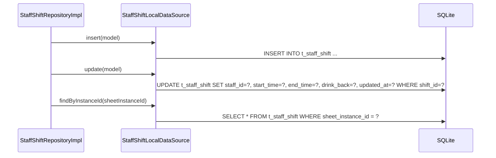

# StaffShiftLocalDataSource（staff_shift_local_datasource.dart）

| 新規作成・更新日 | 作成・更新者名 | 作成・更新内容 |
|---|---|---|
| 2026-09-27 | minamiyama | 新規作成 |

## 処理概要

`t_staff_shift`テーブルに対する実際のSQL実行を担うローカルデータソース。[StaffShiftRepositoryImpl](../repositories/staff_shift_repository_impl.md)から呼び出され、[StaffShiftModel](../models/staff_shift_model.md)を介してSQLiteの行とやり取りする。

## 処理シーケンス図



## insert

### 処理概要
新しい[StaffShiftModel](../models/staff_shift_model.md)を1件永続化する。

### input

| 項目論理名 | 項目物理名 | カプセルの型 | データ型 | バリデーション | 備考 |
|---|---|---|---|---|---|
| シフト | model | - | [StaffShiftModel](../models/staff_shift_model.md) | 必須 | - |

### output

| 項目論理名 | 項目物理名 | カプセルの型 | データ型 | 備考 |
|---|---|---|---|---|
| - | - | - | void | - |

### exception

なし

### 処理詳細
1. `model.toMap`で変換した`Map`を値としたINSERT文をDBに対して1回発行する。
   ```sql
   INSERT INTO t_staff_shift (shift_id, sheet_instance_id, staff_id, start_time, end_time, drink_back, status, created_at, updated_at)
   VALUES (:shiftId, :sheetInstanceId, :staffId, :startTime, :endTime, :drinkBack, :status, :createdAt, :updatedAt);
   ```

## update

### 処理概要
既存の[StaffShiftModel](../models/staff_shift_model.md)の`staff_id`・`start_time`・`end_time`・`drink_back`を上書きする。

### input

| 項目論理名 | 項目物理名 | カプセルの型 | データ型 | バリデーション | 備考 |
|---|---|---|---|---|---|
| シフト | model | - | [StaffShiftModel](../models/staff_shift_model.md) | 必須 | - |

### output

| 項目論理名 | 項目物理名 | カプセルの型 | データ型 | 備考 |
|---|---|---|---|---|
| - | - | - | void | - |

### exception

| exception論理名 | exception物理名 | エラーコード | エラーメッセージ | 備考 |
|---|---|---|---|---|
| レコード未検出 | [RecordNotFoundException](../../../../core/errors/record_not_found_exception.md) | - | - | 対象の`shift_id`が存在しない場合（UPDATE文の影響行数が0件） |

### 処理詳細
1. 以下のSQLをDBに対して1回発行する。
   ```sql
   UPDATE t_staff_shift
   SET staff_id = :staffId, start_time = :startTime, end_time = :endTime, drink_back = :drinkBack, updated_at = :updatedAt
   WHERE shift_id = :shiftId AND status = 'active';
   ```
   条件a: 影響行数が0件の場合、`RecordNotFoundException`を送出する。\
   条件b: 影響行数が1件の場合、正常終了とする。

## findByInstanceId

### 処理概要
`sheetInstanceId`に紐づく有効な[StaffShiftModel](../models/staff_shift_model.md)を`created_at`昇順で取得する。

### input

| 項目論理名 | 項目物理名 | カプセルの型 | データ型 | バリデーション | 備考 |
|---|---|---|---|---|---|
| 伝票インスタンスID | sheetInstanceId | - | string | 必須 | - |

### output

| 項目論理名 | 項目物理名 | カプセルの型 | データ型 | 備考 |
|---|---|---|---|---|
| シフト一覧 | - | list | [StaffShiftModel](../models/staff_shift_model.md) | 該当なしの場合は空リスト |

### exception

なし

### 処理詳細
1. 以下のSQLをDBに対して1回発行する。
   ```sql
   SELECT * FROM t_staff_shift WHERE sheet_instance_id = :sheetInstanceId AND status = 'active' ORDER BY created_at ASC;
   ```
2. 取得結果を[StaffShiftModel.fromMap](../models/staff_shift_model.md)でそれぞれ変換し、リストとして返却する。
