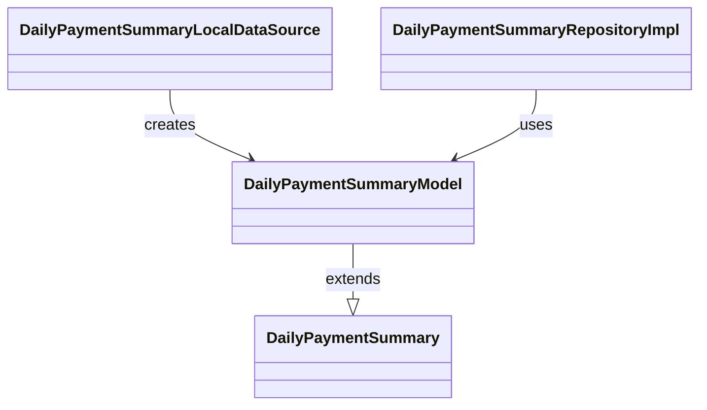

# DailyPaymentSummaryModel（daily_payment_summary_model.dart）

| 新規作成・更新日 | 作成・更新者名 | 作成・更新内容 |
|---|---|---|
| 2026-09-27 | minamiyama | 新規作成 |

## 概要

[DailyPaymentSummary](../../domain/entities/daily_payment_summary.md)のデータ層表現。ビュー`v_daily_payment_summary`（[db_schema.md](../../../../../../../requried/db_schema.md) §6.1）の1行（`Map<String, dynamic>`）から生成する`fromMap`を持つ。読み取り専用のため`toMap`は持たない。`DailyPaymentSummaryModel extends DailyPaymentSummary`として定義し、フィールド定義はエンティティを継承するため本ドキュメントでは重複記載しない（項目定義は[DailyPaymentSummary](../../domain/entities/daily_payment_summary.md)を参照）。[DailyPaymentSummaryLocalDataSource](../datasources/daily_payment_summary_local_datasource.md)・[DailyPaymentSummaryRepositoryImpl](../repositories/daily_payment_summary_repository_impl.md)が使用する。

## 依存関係シーケンス図

## fromMap

### 処理概要
`v_daily_payment_summary`の行（`Map<String, dynamic>`）から`DailyPaymentSummaryModel`を生成する。

### input

| 項目論理名 | 項目物理名 | カプセルの型 | データ型 | バリデーション | 備考 |
|---|---|---|---|---|---|
| DB行データ | map | map | string(key), dynamic(value) | 必須 | `v_daily_payment_summary`ビューの1行分 |

### output

| 項目論理名 | 項目物理名 | カプセルの型 | データ型 | 備考 |
|---|---|---|---|---|
| モデル | - | - | DailyPaymentSummaryModel | - |

### exception

なし

### 処理詳細
1. `map['sheet_instance_id']`→`sheetInstanceId`、`map['business_date']`→DateTimeへ変換して`businessDate`、`map['total_amount']`→`totalAmount`、`map['cash_amount']`→`cashAmount`、`map['card_amount']`→`cardAmount`、`map['paypay_amount']`→`paypayAmount`と対応付け、`DailyPaymentSummaryModel`を生成する。
2. 生成したインスタンスを返却する。
