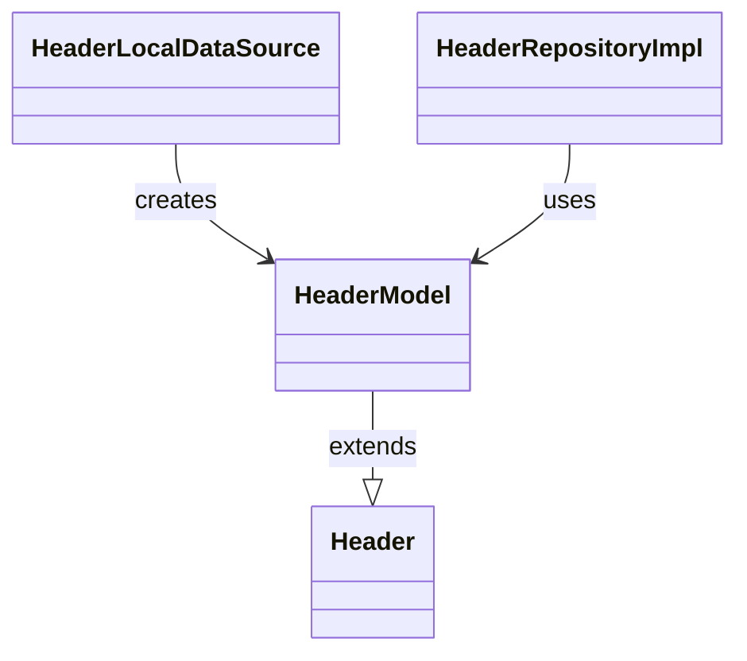

# HeaderModel（header_model.dart）

| 新規作成・更新日 | 作成・更新者名 | 作成・更新内容 |
|---|---|---|
| 2026-09-25 | minamiyama | 新規作成 |

## 概要

[Header](../../domain/entities/header.md)のデータ層表現。SQLiteの行（`Map<String, dynamic>`）と相互変換する`fromMap`/`toMap`を持つ。`HeaderModel extends Header`として定義し、フィールド定義はエンティティを継承するため本ドキュメントでは重複記載しない（項目定義は[Header](../../domain/entities/header.md)を参照）。[HeaderLocalDataSource](../datasources/header_local_datasource.md)・[HeaderRepositoryImpl](../repositories/header_repository_impl.md)が使用する。

## 依存関係シーケンス図

## fromMap

### 処理概要
SQLiteの行（`Map<String, dynamic>`）から`HeaderModel`を生成する。

### input

| 項目論理名 | 項目物理名 | カプセルの型 | データ型 | バリデーション | 備考 |
|---|---|---|---|---|---|
| DB行データ | map | map | string(key), dynamic(value) | 必須 | `m_header`テーブルの1行分 |

### output

| 項目論理名 | 項目物理名 | カプセルの型 | データ型 | 備考 |
|---|---|---|---|---|
| モデル | - | - | HeaderModel | - |

### exception

なし

### 処理詳細
1. `map['column_id']`→`columnId`、`map['sheet_template_id']`→`sheetTemplateId`、`map['type_id']`→`typeId`、`map['name']`→`name`、`map['display_order']`→`displayOrder`、`map['is_priced']`（0/1）→boolへ変換して`isPriced`、`map['status']`→`RecordStatus`へ変換して`status`、`map['created_at']`/`map['updated_at']`→DateTimeへ変換してそれぞれ対応付け、`HeaderModel`を生成する。
2. 生成したインスタンスを返却する。

## toMap

### 処理概要
`HeaderModel`をSQLiteへ保存可能な`Map<String, dynamic>`に変換する。

### input

なし（自身のフィールドを使用する）

### output

| 項目論理名 | 項目物理名 | カプセルの型 | データ型 | 備考 |
|---|---|---|---|---|
| DB行データ | - | map | string(key), dynamic(value) | `isPriced`はint(0/1)、`status`はenum名の文字列、日時はISO8601文字列に変換する |

### exception

なし

### 処理詳細
1. 各フィールドをDBの物理カラム名（snake_case）をキーとした`Map`に変換する。
2. 変換した`Map`を返却する。
