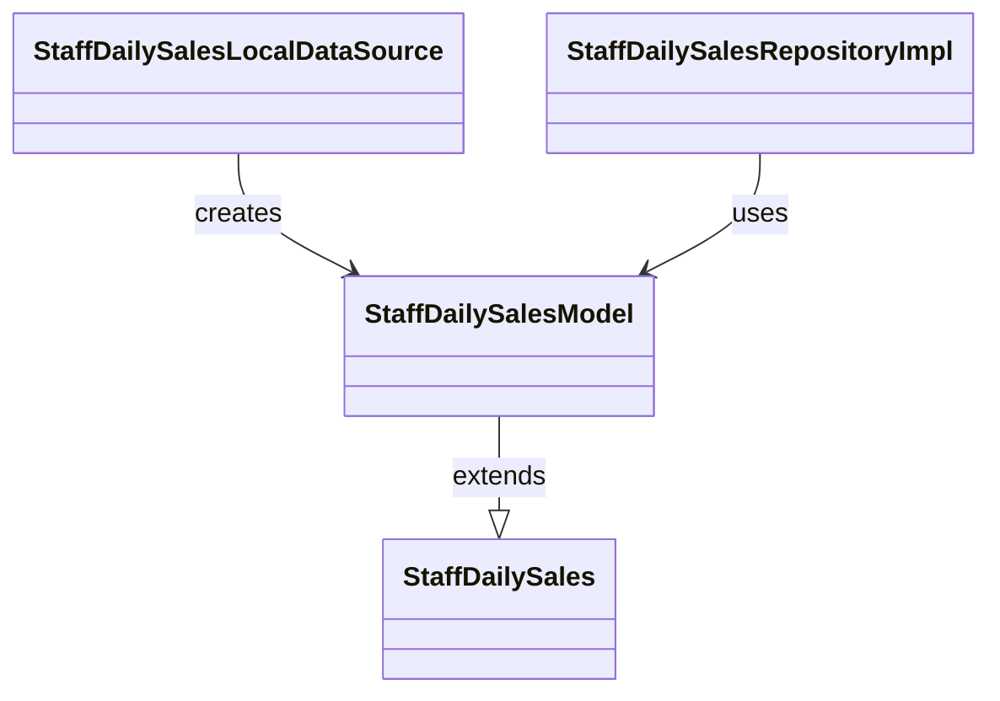

# StaffDailySalesModel（staff_daily_sales_model.dart）

| 新規作成・更新日 | 作成・更新者名 | 作成・更新内容 |
|---|---|---|
| 2026-09-25 | minamiyama | 新規作成 |

## 概要

[StaffDailySales](../../domain/entities/staff_daily_sales.md)のデータ層表現。ビュー`v_staff_daily_sales`の行（`Map<String, dynamic>`）から変換する`fromMap`のみを持つ（永続化対象ではない読み取り専用のビューのため`toMap`は持たない）。`StaffDailySalesModel extends StaffDailySales`として定義し、フィールド定義はエンティティを継承するため本ドキュメントでは重複記載しない（項目定義は[StaffDailySales](../../domain/entities/staff_daily_sales.md)を参照）。[StaffDailySalesLocalDataSource](../datasources/staff_daily_sales_local_datasource.md)・[StaffDailySalesRepositoryImpl](../repositories/staff_daily_sales_repository_impl.md)が使用する。

## 依存関係シーケンス図

## fromMap

### 処理概要
ビュー`v_staff_daily_sales`の行（`Map<String, dynamic>`）から`StaffDailySalesModel`を生成する。

### input

| 項目論理名 | 項目物理名 | カプセルの型 | データ型 | バリデーション | 備考 |
|---|---|---|---|---|---|
| DB行データ | map | map | string(key), dynamic(value) | 必須 | `v_staff_daily_sales`ビューの1行分 |

### output

| 項目論理名 | 項目物理名 | カプセルの型 | データ型 | 備考 |
|---|---|---|---|---|
| モデル | - | - | StaffDailySalesModel | - |

### exception

なし

### 処理詳細
1. `map['staff_id']`→`staffId`、`map['staff_name']`→`staffName`、`map['business_date']`→DateTimeへ変換して`businessDate`、`map['customer_count']`→`customerCount`、`map['total_sales']`→`totalSales`に対応付け、`StaffDailySalesModel`を生成する。
2. 生成したインスタンスを返却する。
