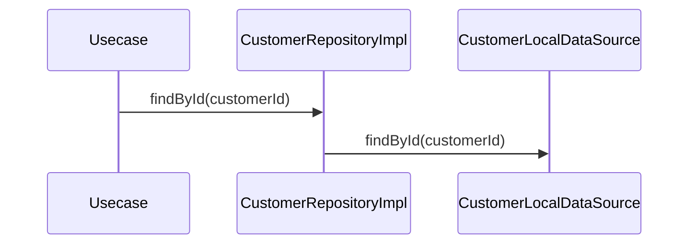

# CustomerRepositoryImpl（customer_repository_impl.dart）

| 新規作成・更新日 | 作成・更新者名 | 作成・更新内容 |
|---|---|---|
| 2026-09-25 | minamiyama | 新規作成 |

## 処理概要

[CustomerRepository](../../domain/repositories/customer_repository.md)（domain層インターフェース）の実装クラス。[CustomerLocalDataSource](../datasources/customer_local_datasource.md)へ処理を委譲する。[CustomerModel](../models/customer_model.md)は[Customer](../../domain/entities/customer.md)のサブクラスのため、返却値をそのままdomain層の戻り値として返却できる。

## 処理シーケンス図

## findById

### 処理概要
[CustomerLocalDataSource.findById](../datasources/customer_local_datasource.md)に処理を委譲する。

### input

| 項目論理名 | 項目物理名 | カプセルの型 | データ型 | バリデーション | 備考 |
|---|---|---|---|---|---|
| 顧客ID | customerId | - | string | 必須 | - |

### output

| 項目論理名 | 項目物理名 | カプセルの型 | データ型 | 備考 |
|---|---|---|---|---|
| 顧客 | - | - | [Customer](../../domain/entities/customer.md) | 実体は[CustomerModel](../models/customer_model.md) |

### exception

| exception論理名 | exception物理名 | エラーコード | エラーメッセージ | 備考 |
|---|---|---|---|---|
| レコード未検出 | [RecordNotFoundException](../../../../core/errors/record_not_found_exception.md) | - | - | [CustomerLocalDataSource.findById](../datasources/customer_local_datasource.md)からそのまま伝播 |

### 処理詳細
1. [CustomerLocalDataSource.findById](../datasources/customer_local_datasource.md)を呼び出し、結果をそのまま返却する。
