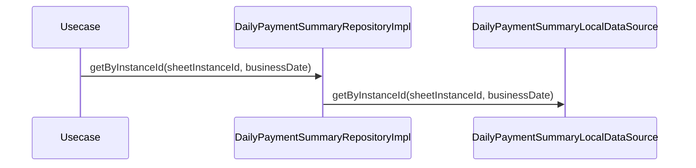

# DailyPaymentSummaryRepositoryImpl（daily_payment_summary_repository_impl.dart）

| 新規作成・更新日 | 作成・更新者名 | 作成・更新内容 |
|---|---|---|
| 2026-09-27 | minamiyama | 新規作成 |

## 処理概要

[DailyPaymentSummaryRepository](../../domain/repositories/daily_payment_summary_repository.md)（domain層インターフェース）の実装クラス。[DailyPaymentSummaryLocalDataSource](../datasources/daily_payment_summary_local_datasource.md)へ処理を委譲する。[DailyPaymentSummaryModel](../models/daily_payment_summary_model.md)は[DailyPaymentSummary](../../domain/entities/daily_payment_summary.md)のサブクラスのため、返却値をそのままdomain層の戻り値として返却できる。

## 処理シーケンス図

## getByInstanceId

### 処理概要
[DailyPaymentSummaryLocalDataSource.getByInstanceId](../datasources/daily_payment_summary_local_datasource.md)に処理を委譲する。

### input

| 項目論理名 | 項目物理名 | カプセルの型 | データ型 | バリデーション | 備考 |
|---|---|---|---|---|---|
| 伝票インスタンスID | sheetInstanceId | - | string | 必須 | - |
| 営業日 | businessDate | - | DateTime | 必須, 日付のみ | - |

### output

| 項目論理名 | 項目物理名 | カプセルの型 | データ型 | 備考 |
|---|---|---|---|---|
| 日次集計 | - | - | [DailyPaymentSummary](../../domain/entities/daily_payment_summary.md) | 実体は[DailyPaymentSummaryModel](../models/daily_payment_summary_model.md) |

### exception

なし

### 処理詳細
1. [DailyPaymentSummaryLocalDataSource.getByInstanceId](../datasources/daily_payment_summary_local_datasource.md)を呼び出し、結果をそのまま返却する。
