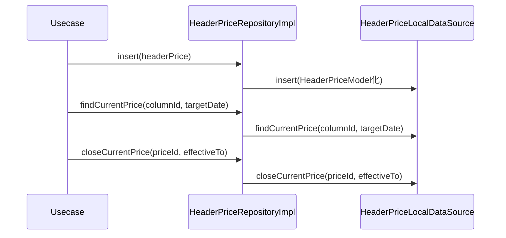

# HeaderPriceRepositoryImpl（header_price_repository_impl.dart）

| 新規作成・更新日 | 作成・更新者名 | 作成・更新内容 |
|---|---|---|
| 2026-09-25 | minamiyama | 新規作成 |

## 処理概要

[HeaderPriceRepository](../../domain/repositories/header_price_repository.md)（domain層インターフェース）の実装クラス。[HeaderPriceLocalDataSource](../datasources/header_price_local_datasource.md)へ処理を委譲する。[HeaderPriceModel](../models/header_price_model.md)は[HeaderPrice](../../domain/entities/header_price.md)のサブクラスのため、返却値をそのままdomain層の戻り値として返却できる。

## 処理シーケンス図

## insert

### 処理概要
[HeaderPriceLocalDataSource.insert](../datasources/header_price_local_datasource.md)に処理を委譲する。

### input

| 項目論理名 | 項目物理名 | カプセルの型 | データ型 | バリデーション | 備考 |
|---|---|---|---|---|---|
| 単価改定履歴 | headerPrice | - | [HeaderPrice](../../domain/entities/header_price.md) | 必須 | - |

### output

| 項目論理名 | 項目物理名 | カプセルの型 | データ型 | 備考 |
|---|---|---|---|---|
| - | - | - | void | - |

### exception

なし

### 処理詳細
1. `headerPrice`を[HeaderPriceModel](../models/header_price_model.md)へ変換し、[HeaderPriceLocalDataSource.insert](../datasources/header_price_local_datasource.md)を呼び出す。

## findCurrentPrice

### 処理概要
[HeaderPriceLocalDataSource.findCurrentPrice](../datasources/header_price_local_datasource.md)に処理を委譲する。

### input

| 項目論理名 | 項目物理名 | カプセルの型 | データ型 | バリデーション | 備考 |
|---|---|---|---|---|---|
| 列ID | columnId | - | string | 必須 | - |
| 対象日 | targetDate | - | DateTime | 必須, 日付のみ | - |

### output

| 項目論理名 | 項目物理名 | カプセルの型 | データ型 | 備考 |
|---|---|---|---|---|
| 単価改定履歴 | - | - | [HeaderPrice](../../domain/entities/header_price.md) | 実体は[HeaderPriceModel](../models/header_price_model.md) |

### exception

| exception論理名 | exception物理名 | エラーコード | エラーメッセージ | 備考 |
|---|---|---|---|---|
| レコード未検出 | [RecordNotFoundException](../../../../core/errors/record_not_found_exception.md) | - | - | [HeaderPriceLocalDataSource.findCurrentPrice](../datasources/header_price_local_datasource.md)からそのまま伝播 |

### 処理詳細
1. [HeaderPriceLocalDataSource.findCurrentPrice](../datasources/header_price_local_datasource.md)を呼び出し、結果をそのまま返却する。

## closeCurrentPrice

### 処理概要
[HeaderPriceLocalDataSource.closeCurrentPrice](../datasources/header_price_local_datasource.md)に処理を委譲する。

### input

| 項目論理名 | 項目物理名 | カプセルの型 | データ型 | バリデーション | 備考 |
|---|---|---|---|---|---|
| 価格ID | priceId | - | string | 必須 | - |
| 適用終了日 | effectiveTo | - | DateTime | 必須, 日付のみ | - |

### output

| 項目論理名 | 項目物理名 | カプセルの型 | データ型 | 備考 |
|---|---|---|---|---|
| - | - | - | void | - |

### exception

なし

### 処理詳細
1. [HeaderPriceLocalDataSource.closeCurrentPrice](../datasources/header_price_local_datasource.md)を`priceId`・`effectiveTo`で呼び出す。
