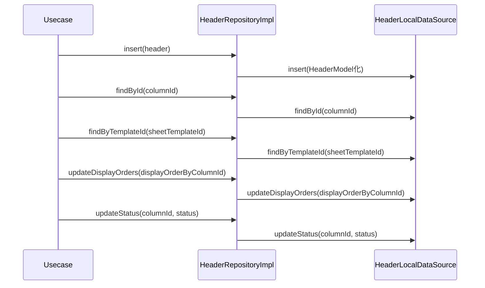

# HeaderRepositoryImpl（header_repository_impl.dart）

| 新規作成・更新日 | 作成・更新者名 | 作成・更新内容 |
|---|---|---|
| 2026-09-25 | minamiyama | 新規作成 |

## 処理概要

[HeaderRepository](../../domain/repositories/header_repository.md)（domain層インターフェース）の実装クラス。[HeaderLocalDataSource](../datasources/header_local_datasource.md)へ処理を委譲する。[HeaderModel](../models/header_model.md)は[Header](../../domain/entities/header.md)のサブクラスのため、返却値をそのままdomain層の戻り値として返却できる。

## 処理シーケンス図

## insert

### 処理概要
[HeaderLocalDataSource.insert](../datasources/header_local_datasource.md)に処理を委譲する。

### input

| 項目論理名 | 項目物理名 | カプセルの型 | データ型 | バリデーション | 備考 |
|---|---|---|---|---|---|
| 列 | header | - | [Header](../../domain/entities/header.md) | 必須 | - |

### output

| 項目論理名 | 項目物理名 | カプセルの型 | データ型 | 備考 |
|---|---|---|---|---|
| - | - | - | void | - |

### exception

なし

### 処理詳細
1. `header`を[HeaderModel](../models/header_model.md)へ変換し、[HeaderLocalDataSource.insert](../datasources/header_local_datasource.md)を呼び出す。

## findById

### 処理概要
[HeaderLocalDataSource.findById](../datasources/header_local_datasource.md)に処理を委譲する。

### input

| 項目論理名 | 項目物理名 | カプセルの型 | データ型 | バリデーション | 備考 |
|---|---|---|---|---|---|
| 列ID | columnId | - | string | 必須 | - |

### output

| 項目論理名 | 項目物理名 | カプセルの型 | データ型 | 備考 |
|---|---|---|---|---|
| 列 | - | - | [Header](../../domain/entities/header.md) | 実体は[HeaderModel](../models/header_model.md) |

### exception

| exception論理名 | exception物理名 | エラーコード | エラーメッセージ | 備考 |
|---|---|---|---|---|
| レコード未検出 | [RecordNotFoundException](../../../../core/errors/record_not_found_exception.md) | - | - | [HeaderLocalDataSource.findById](../datasources/header_local_datasource.md)からそのまま伝播 |

### 処理詳細
1. [HeaderLocalDataSource.findById](../datasources/header_local_datasource.md)を呼び出し、結果をそのまま返却する。

## findByTemplateId

### 処理概要
[HeaderLocalDataSource.findByTemplateId](../datasources/header_local_datasource.md)に処理を委譲する。

### input

| 項目論理名 | 項目物理名 | カプセルの型 | データ型 | バリデーション | 備考 |
|---|---|---|---|---|---|
| 伝票フォーマットID | sheetTemplateId | - | string | 必須 | - |

### output

| 項目論理名 | 項目物理名 | カプセルの型 | データ型 | 備考 |
|---|---|---|---|---|
| 列一覧 | - | list | [Header](../../domain/entities/header.md) | 実体は[HeaderModel](../models/header_model.md)のリスト |

### exception

なし

### 処理詳細
1. [HeaderLocalDataSource.findByTemplateId](../datasources/header_local_datasource.md)を呼び出し、結果をそのまま返却する。

## updateDisplayOrders

### 処理概要
[HeaderLocalDataSource.updateDisplayOrders](../datasources/header_local_datasource.md)に処理を委譲する。

### input

| 項目論理名 | 項目物理名 | カプセルの型 | データ型 | バリデーション | 備考 |
|---|---|---|---|---|---|
| 列IDと表示順の対応 | displayOrderByColumnId | map | string(key), int(value) | 必須, 1件以上 | - |

### output

| 項目論理名 | 項目物理名 | カプセルの型 | データ型 | 備考 |
|---|---|---|---|---|
| - | - | - | void | - |

### exception

なし

### 処理詳細
1. [HeaderLocalDataSource.updateDisplayOrders](../datasources/header_local_datasource.md)を`displayOrderByColumnId`で呼び出す。

## updateStatus

### 処理概要
[HeaderLocalDataSource.updateStatus](../datasources/header_local_datasource.md)に処理を委譲する。

### input

| 項目論理名 | 項目物理名 | カプセルの型 | データ型 | バリデーション | 備考 |
|---|---|---|---|---|---|
| 列ID | columnId | - | string | 必須 | - |
| 論理削除状態 | status | - | [RecordStatus](../../domain/entities/enums/record_status.md) | 必須 | - |

### output

| 項目論理名 | 項目物理名 | カプセルの型 | データ型 | 備考 |
|---|---|---|---|---|
| - | - | - | void | - |

### exception

なし

### 処理詳細
1. [HeaderLocalDataSource.updateStatus](../datasources/header_local_datasource.md)を`columnId`・`status`で呼び出す。
