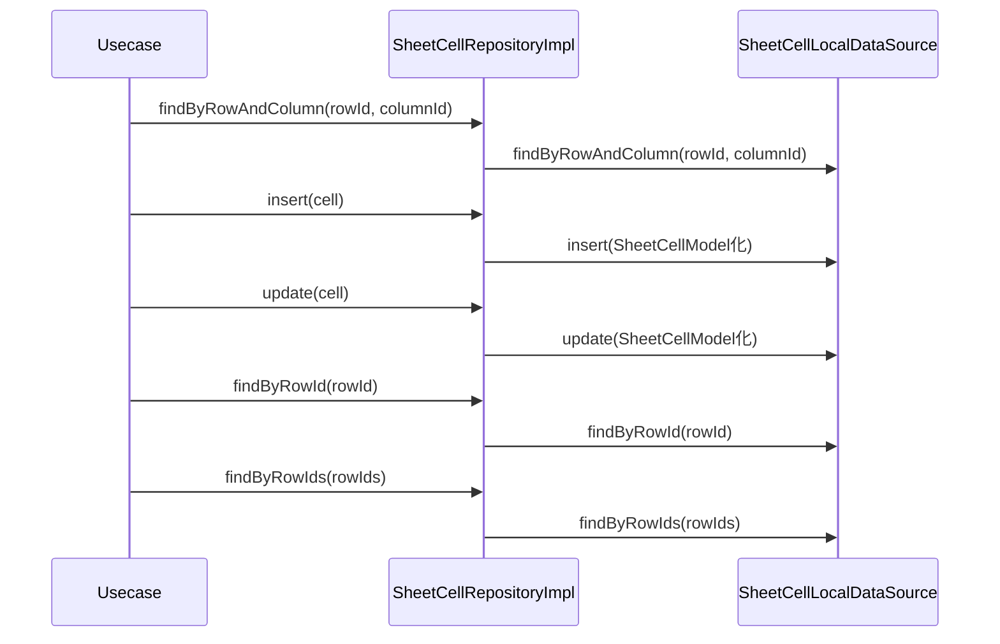

# SheetCellRepositoryImpl（sheet_cell_repository_impl.dart）

| 新規作成・更新日 | 作成・更新者名 | 作成・更新内容 |
|---|---|---|
| 2026-09-25 | minamiyama | 新規作成 |

## 処理概要

[SheetCellRepository](../../domain/repositories/sheet_cell_repository.md)（domain層インターフェース）の実装クラス。[SheetCellLocalDataSource](../datasources/sheet_cell_local_datasource.md)へ処理を委譲する。[SheetCellModel](../models/sheet_cell_model.md)は[SheetCell](../../domain/entities/sheet_cell.md)のサブクラスのため、返却値をそのままdomain層の戻り値として返却できる。

## 処理シーケンス図

## findByRowAndColumn

### 処理概要
[SheetCellLocalDataSource.findByRowAndColumn](../datasources/sheet_cell_local_datasource.md)に処理を委譲する。

### input

| 項目論理名 | 項目物理名 | カプセルの型 | データ型 | バリデーション | 備考 |
|---|---|---|---|---|---|
| 行ID | rowId | - | string | 必須 | - |
| 列ID | columnId | - | string | 必須 | - |

### output

| 項目論理名 | 項目物理名 | カプセルの型 | データ型 | 備考 |
|---|---|---|---|---|
| セル | - | optional | [SheetCell](../../domain/entities/sheet_cell.md) | 未入力の場合は`null`。実体は[SheetCellModel](../models/sheet_cell_model.md) |

### exception

なし

### 処理詳細
1. [SheetCellLocalDataSource.findByRowAndColumn](../datasources/sheet_cell_local_datasource.md)を呼び出し、結果をそのまま返却する。

## insert

### 処理概要
[SheetCellLocalDataSource.insert](../datasources/sheet_cell_local_datasource.md)に処理を委譲する。

### input

| 項目論理名 | 項目物理名 | カプセルの型 | データ型 | バリデーション | 備考 |
|---|---|---|---|---|---|
| セル | cell | - | [SheetCell](../../domain/entities/sheet_cell.md) | 必須 | - |

### output

| 項目論理名 | 項目物理名 | カプセルの型 | データ型 | 備考 |
|---|---|---|---|---|
| - | - | - | void | - |

### exception

なし

### 処理詳細
1. `cell`を[SheetCellModel](../models/sheet_cell_model.md)へ変換し、[SheetCellLocalDataSource.insert](../datasources/sheet_cell_local_datasource.md)を呼び出す。

## update

### 処理概要
[SheetCellLocalDataSource.update](../datasources/sheet_cell_local_datasource.md)に処理を委譲する。

### input

| 項目論理名 | 項目物理名 | カプセルの型 | データ型 | バリデーション | 備考 |
|---|---|---|---|---|---|
| セル | cell | - | [SheetCell](../../domain/entities/sheet_cell.md) | 必須, `cellId`が既存レコードと一致すること | - |

### output

| 項目論理名 | 項目物理名 | カプセルの型 | データ型 | 備考 |
|---|---|---|---|---|
| - | - | - | void | - |

### exception

なし

### 処理詳細
1. `cell`を[SheetCellModel](../models/sheet_cell_model.md)へ変換し、[SheetCellLocalDataSource.update](../datasources/sheet_cell_local_datasource.md)を呼び出す。

## findByRowId

### 処理概要
[SheetCellLocalDataSource.findByRowId](../datasources/sheet_cell_local_datasource.md)に処理を委譲する。

### input

| 項目論理名 | 項目物理名 | カプセルの型 | データ型 | バリデーション | 備考 |
|---|---|---|---|---|---|
| 行ID | rowId | - | string | 必須 | - |

### output

| 項目論理名 | 項目物理名 | カプセルの型 | データ型 | 備考 |
|---|---|---|---|---|
| セル一覧 | - | list | [SheetCell](../../domain/entities/sheet_cell.md) | 実体は[SheetCellModel](../models/sheet_cell_model.md)のリスト |

### exception

なし

### 処理詳細
1. [SheetCellLocalDataSource.findByRowId](../datasources/sheet_cell_local_datasource.md)を呼び出し、結果をそのまま返却する。

## findByRowIds

### 処理概要
[SheetCellLocalDataSource.findByRowIds](../datasources/sheet_cell_local_datasource.md)に処理を委譲する。

### input

| 項目論理名 | 項目物理名 | カプセルの型 | データ型 | バリデーション | 備考 |
|---|---|---|---|---|---|
| 行IDリスト | rowIds | list | string | 必須, 1件以上 | - |

### output

| 項目論理名 | 項目物理名 | カプセルの型 | データ型 | 備考 |
|---|---|---|---|---|
| セル一覧 | - | list | [SheetCell](../../domain/entities/sheet_cell.md) | 実体は[SheetCellModel](../models/sheet_cell_model.md)のリスト |

### exception

なし

### 処理詳細
1. [SheetCellLocalDataSource.findByRowIds](../datasources/sheet_cell_local_datasource.md)を呼び出し、結果をそのまま返却する。
