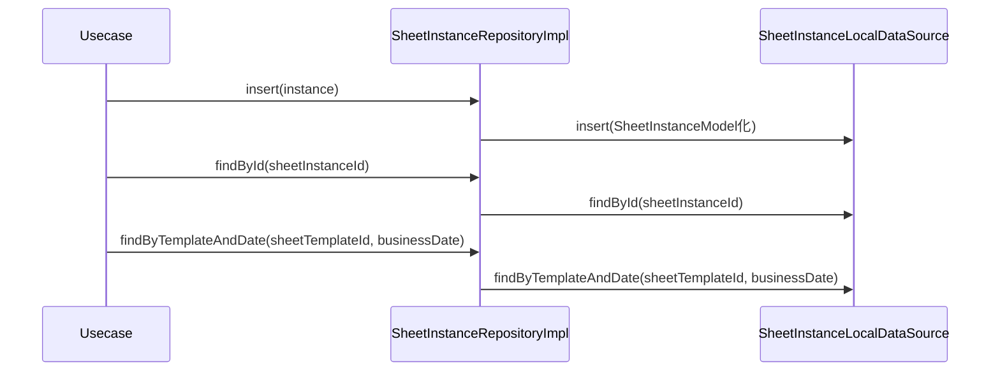

# SheetInstanceRepositoryImpl（sheet_instance_repository_impl.dart）

| 新規作成・更新日 | 作成・更新者名 | 作成・更新内容 |
|---|---|---|
| 2026-09-25 | minamiyama | 新規作成 |

## 処理概要

[SheetInstanceRepository](../../domain/repositories/sheet_instance_repository.md)（domain層インターフェース）の実装クラス。[SheetInstanceLocalDataSource](../datasources/sheet_instance_local_datasource.md)へ処理を委譲する。[SheetInstanceModel](../models/sheet_instance_model.md)は[SheetInstance](../../domain/entities/sheet_instance.md)のサブクラスのため、返却値をそのままdomain層の戻り値として返却できる。

## 処理シーケンス図

## insert

### 処理概要
[SheetInstanceLocalDataSource.insert](../datasources/sheet_instance_local_datasource.md)に処理を委譲する。

### input

| 項目論理名 | 項目物理名 | カプセルの型 | データ型 | バリデーション | 備考 |
|---|---|---|---|---|---|
| 伝票インスタンス | instance | - | [SheetInstance](../../domain/entities/sheet_instance.md) | 必須 | - |

### output

| 項目論理名 | 項目物理名 | カプセルの型 | データ型 | 備考 |
|---|---|---|---|---|
| - | - | - | void | - |

### exception

なし

### 処理詳細
1. `instance`を[SheetInstanceModel](../models/sheet_instance_model.md)へ変換し、[SheetInstanceLocalDataSource.insert](../datasources/sheet_instance_local_datasource.md)を呼び出す。

## findById

### 処理概要
[SheetInstanceLocalDataSource.findById](../datasources/sheet_instance_local_datasource.md)に処理を委譲する。

### input

| 項目論理名 | 項目物理名 | カプセルの型 | データ型 | バリデーション | 備考 |
|---|---|---|---|---|---|
| 伝票インスタンスID | sheetInstanceId | - | string | 必須 | - |

### output

| 項目論理名 | 項目物理名 | カプセルの型 | データ型 | 備考 |
|---|---|---|---|---|
| 伝票インスタンス | - | - | [SheetInstance](../../domain/entities/sheet_instance.md) | 実体は[SheetInstanceModel](../models/sheet_instance_model.md) |

### exception

| exception論理名 | exception物理名 | エラーコード | エラーメッセージ | 備考 |
|---|---|---|---|---|
| レコード未検出 | [RecordNotFoundException](../../../../core/errors/record_not_found_exception.md) | - | - | [SheetInstanceLocalDataSource.findById](../datasources/sheet_instance_local_datasource.md)からそのまま伝播 |

### 処理詳細
1. [SheetInstanceLocalDataSource.findById](../datasources/sheet_instance_local_datasource.md)を呼び出し、結果をそのまま返却する。

## findByTemplateAndDate

### 処理概要
[SheetInstanceLocalDataSource.findByTemplateAndDate](../datasources/sheet_instance_local_datasource.md)に処理を委譲する。

### input

| 項目論理名 | 項目物理名 | カプセルの型 | データ型 | バリデーション | 備考 |
|---|---|---|---|---|---|
| 伝票フォーマットID | sheetTemplateId | - | string | 必須 | - |
| 営業日 | businessDate | - | DateTime | 必須, 日付のみ | - |

### output

| 項目論理名 | 項目物理名 | カプセルの型 | データ型 | 備考 |
|---|---|---|---|---|
| 伝票インスタンス | - | optional | [SheetInstance](../../domain/entities/sheet_instance.md) | 未作成の場合は`null`。実体は[SheetInstanceModel](../models/sheet_instance_model.md) |

### exception

なし

### 処理詳細
1. [SheetInstanceLocalDataSource.findByTemplateAndDate](../datasources/sheet_instance_local_datasource.md)を呼び出し、結果をそのまま返却する。
