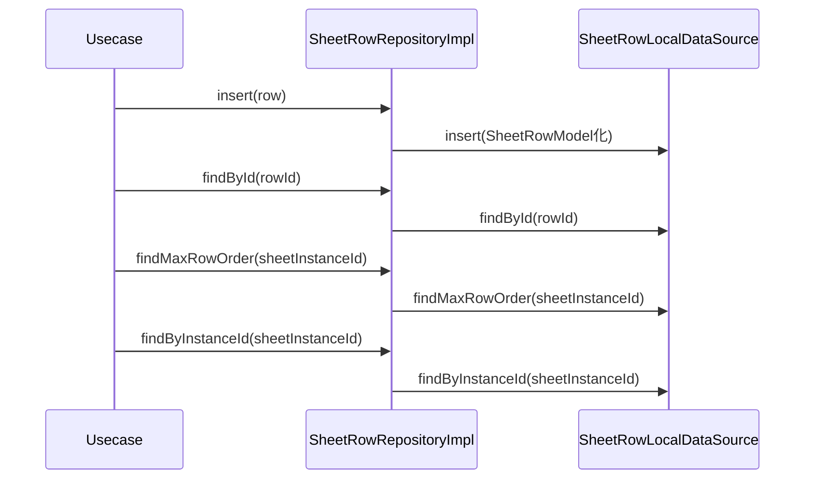

# SheetRowRepositoryImpl（sheet_row_repository_impl.dart）

| 新規作成・更新日 | 作成・更新者名 | 作成・更新内容 |
|---|---|---|
| 2026-09-25 | minamiyama | 新規作成 |

## 処理概要

[SheetRowRepository](../../domain/repositories/sheet_row_repository.md)（domain層インターフェース）の実装クラス。[SheetRowLocalDataSource](../datasources/sheet_row_local_datasource.md)へ処理を委譲する。[SheetRowModel](../models/sheet_row_model.md)は[SheetRow](../../domain/entities/sheet_row.md)のサブクラスのため、返却値をそのままdomain層の戻り値として返却できる。

## 処理シーケンス図

## insert

### 処理概要
[SheetRowLocalDataSource.insert](../datasources/sheet_row_local_datasource.md)に処理を委譲する。

### input

| 項目論理名 | 項目物理名 | カプセルの型 | データ型 | バリデーション | 備考 |
|---|---|---|---|---|---|
| 行 | row | - | [SheetRow](../../domain/entities/sheet_row.md) | 必須 | - |

### output

| 項目論理名 | 項目物理名 | カプセルの型 | データ型 | 備考 |
|---|---|---|---|---|
| - | - | - | void | - |

### exception

なし

### 処理詳細
1. `row`を[SheetRowModel](../models/sheet_row_model.md)へ変換し、[SheetRowLocalDataSource.insert](../datasources/sheet_row_local_datasource.md)を呼び出す。

## findById

### 処理概要
[SheetRowLocalDataSource.findById](../datasources/sheet_row_local_datasource.md)に処理を委譲する。

### input

| 項目論理名 | 項目物理名 | カプセルの型 | データ型 | バリデーション | 備考 |
|---|---|---|---|---|---|
| 行ID | rowId | - | string | 必須 | - |

### output

| 項目論理名 | 項目物理名 | カプセルの型 | データ型 | 備考 |
|---|---|---|---|---|
| 行 | - | - | [SheetRow](../../domain/entities/sheet_row.md) | 実体は[SheetRowModel](../models/sheet_row_model.md) |

### exception

| exception論理名 | exception物理名 | エラーコード | エラーメッセージ | 備考 |
|---|---|---|---|---|
| レコード未検出 | [RecordNotFoundException](../../../../core/errors/record_not_found_exception.md) | - | - | [SheetRowLocalDataSource.findById](../datasources/sheet_row_local_datasource.md)からそのまま伝播 |

### 処理詳細
1. [SheetRowLocalDataSource.findById](../datasources/sheet_row_local_datasource.md)を呼び出し、結果をそのまま返却する。

## findMaxRowOrder

### 処理概要
[SheetRowLocalDataSource.findMaxRowOrder](../datasources/sheet_row_local_datasource.md)に処理を委譲する。

### input

| 項目論理名 | 項目物理名 | カプセルの型 | データ型 | バリデーション | 備考 |
|---|---|---|---|---|---|
| 伝票インスタンスID | sheetInstanceId | - | string | 必須 | - |

### output

| 項目論理名 | 項目物理名 | カプセルの型 | データ型 | 備考 |
|---|---|---|---|---|
| 最大表示順 | - | - | int | 該当行なしの場合は0 |

### exception

なし

### 処理詳細
1. [SheetRowLocalDataSource.findMaxRowOrder](../datasources/sheet_row_local_datasource.md)を呼び出し、結果をそのまま返却する。

## findByInstanceId

### 処理概要
[SheetRowLocalDataSource.findByInstanceId](../datasources/sheet_row_local_datasource.md)に処理を委譲する。

### input

| 項目論理名 | 項目物理名 | カプセルの型 | データ型 | バリデーション | 備考 |
|---|---|---|---|---|---|
| 伝票インスタンスID | sheetInstanceId | - | string | 必須 | - |

### output

| 項目論理名 | 項目物理名 | カプセルの型 | データ型 | 備考 |
|---|---|---|---|---|
| 行一覧 | - | list | [SheetRow](../../domain/entities/sheet_row.md) | 実体は[SheetRowModel](../models/sheet_row_model.md)のリスト |

### exception

なし

### 処理詳細
1. [SheetRowLocalDataSource.findByInstanceId](../datasources/sheet_row_local_datasource.md)を呼び出し、結果をそのまま返却する。
