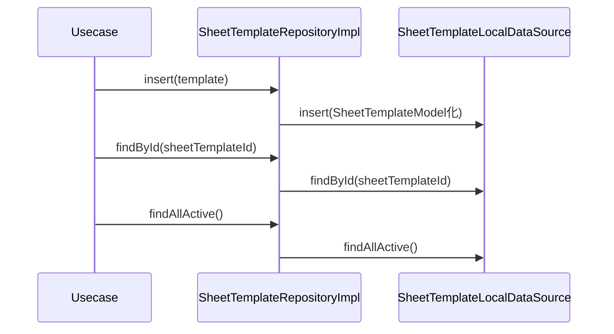

# SheetTemplateRepositoryImpl（sheet_template_repository_impl.dart）

| 新規作成・更新日 | 作成・更新者名 | 作成・更新内容 |
|---|---|---|
| 2026-09-25 | minamiyama | 新規作成 |

## 処理概要

[SheetTemplateRepository](../../domain/repositories/sheet_template_repository.md)（domain層インターフェース）の実装クラス。[SheetTemplateLocalDataSource](../datasources/sheet_template_local_datasource.md)へ処理を委譲する。[SheetTemplateModel](../models/sheet_template_model.md)は[SheetTemplate](../../domain/entities/sheet_template.md)のサブクラスのため、データソースの返却値をそのままdomain層の戻り値として返却できる（明示的な変換処理は不要）。

## 処理シーケンス図

## insert

### 処理概要
[SheetTemplateLocalDataSource.insert](../datasources/sheet_template_local_datasource.md)に処理を委譲する。

### input

| 項目論理名 | 項目物理名 | カプセルの型 | データ型 | バリデーション | 備考 |
|---|---|---|---|---|---|
| 伝票フォーマット | template | - | [SheetTemplate](../../domain/entities/sheet_template.md) | 必須 | - |

### output

| 項目論理名 | 項目物理名 | カプセルの型 | データ型 | 備考 |
|---|---|---|---|---|
| - | - | - | void | - |

### exception

なし

### 処理詳細
1. `template`を[SheetTemplateModel](../models/sheet_template_model.md)へ変換し、[SheetTemplateLocalDataSource.insert](../datasources/sheet_template_local_datasource.md)を呼び出す。

## findById

### 処理概要
[SheetTemplateLocalDataSource.findById](../datasources/sheet_template_local_datasource.md)に処理を委譲する。

### input

| 項目論理名 | 項目物理名 | カプセルの型 | データ型 | バリデーション | 備考 |
|---|---|---|---|---|---|
| 伝票フォーマットID | sheetTemplateId | - | string | 必須 | - |

### output

| 項目論理名 | 項目物理名 | カプセルの型 | データ型 | 備考 |
|---|---|---|---|---|
| 伝票フォーマット | - | - | [SheetTemplate](../../domain/entities/sheet_template.md) | 実体は[SheetTemplateModel](../models/sheet_template_model.md) |

### exception

| exception論理名 | exception物理名 | エラーコード | エラーメッセージ | 備考 |
|---|---|---|---|---|
| レコード未検出 | [RecordNotFoundException](../../../../core/errors/record_not_found_exception.md) | - | - | [SheetTemplateLocalDataSource.findById](../datasources/sheet_template_local_datasource.md)からそのまま伝播 |

### 処理詳細
1. [SheetTemplateLocalDataSource.findById](../datasources/sheet_template_local_datasource.md)を呼び出し、結果をそのまま返却する（`SheetTemplateModel`は`SheetTemplate`のサブクラスのため変換不要）。

## findAllActive

### 処理概要
[SheetTemplateLocalDataSource.findAllActive](../datasources/sheet_template_local_datasource.md)に処理を委譲する。

### input

なし

### output

| 項目論理名 | 項目物理名 | カプセルの型 | データ型 | 備考 |
|---|---|---|---|---|
| 伝票フォーマット一覧 | - | list | [SheetTemplate](../../domain/entities/sheet_template.md) | 実体は[SheetTemplateModel](../models/sheet_template_model.md)のリスト |

### exception

なし

### 処理詳細
1. [SheetTemplateLocalDataSource.findAllActive](../datasources/sheet_template_local_datasource.md)を呼び出し、結果をそのまま返却する。
