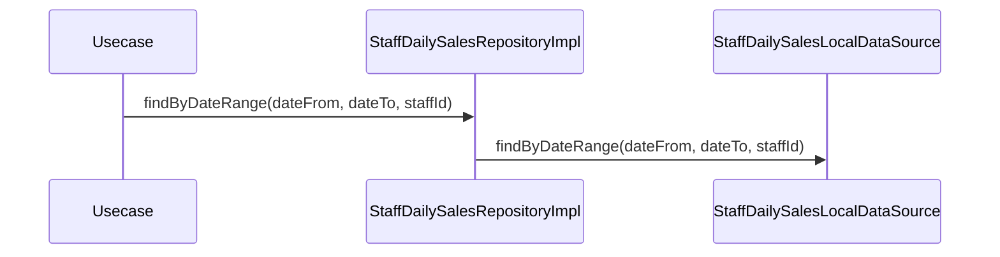

# StaffDailySalesRepositoryImpl（staff_daily_sales_repository_impl.dart）

| 新規作成・更新日 | 作成・更新者名 | 作成・更新内容 |
|---|---|---|
| 2026-09-25 | minamiyama | 新規作成 |

## 処理概要

[StaffDailySalesRepository](../../domain/repositories/staff_daily_sales_repository.md)（domain層インターフェース）の実装クラス。[StaffDailySalesLocalDataSource](../datasources/staff_daily_sales_local_datasource.md)へ処理を委譲する。[StaffDailySalesModel](../models/staff_daily_sales_model.md)は[StaffDailySales](../../domain/entities/staff_daily_sales.md)のサブクラスのため、返却値をそのままdomain層の戻り値として返却できる。

## 処理シーケンス図

## findByDateRange

### 処理概要
[StaffDailySalesLocalDataSource.findByDateRange](../datasources/staff_daily_sales_local_datasource.md)に処理を委譲する。

### input

| 項目論理名 | 項目物理名 | カプセルの型 | データ型 | バリデーション | 備考 |
|---|---|---|---|---|---|
| 営業日(開始) | dateFrom | - | DateTime | 必須, 日付のみ | - |
| 営業日(終了) | dateTo | - | DateTime | 必須, 日付のみ, `dateFrom`以降 | - |
| スタッフID | staffId | optional | string | 任意 | - |

### output

| 項目論理名 | 項目物理名 | カプセルの型 | データ型 | 備考 |
|---|---|---|---|---|
| スタッフ別日別売上一覧 | - | list | [StaffDailySales](../../domain/entities/staff_daily_sales.md) | 実体は[StaffDailySalesModel](../models/staff_daily_sales_model.md)のリスト |

### exception

なし

### 処理詳細
1. [StaffDailySalesLocalDataSource.findByDateRange](../datasources/staff_daily_sales_local_datasource.md)を呼び出し、結果をそのまま返却する。
