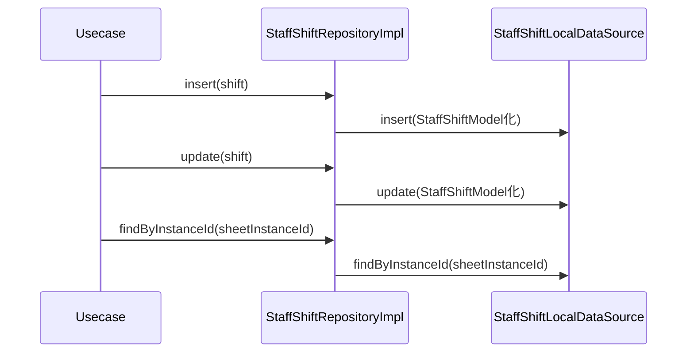

# StaffShiftRepositoryImpl（staff_shift_repository_impl.dart）

| 新規作成・更新日 | 作成・更新者名 | 作成・更新内容 |
|---|---|---|
| 2026-09-27 | minamiyama | 新規作成 |

## 処理概要

[StaffShiftRepository](../../domain/repositories/staff_shift_repository.md)（domain層インターフェース）の実装クラス。[StaffShiftLocalDataSource](../datasources/staff_shift_local_datasource.md)へ処理を委譲する。[StaffShiftModel](../models/staff_shift_model.md)は[StaffShift](../../domain/entities/staff_shift.md)のサブクラスのため、返却値をそのままdomain層の戻り値として返却できる。

## 処理シーケンス図

## insert

### 処理概要
[StaffShiftLocalDataSource.insert](../datasources/staff_shift_local_datasource.md)に処理を委譲する。

### input

| 項目論理名 | 項目物理名 | カプセルの型 | データ型 | バリデーション | 備考 |
|---|---|---|---|---|---|
| スタッフシフト | shift | - | [StaffShift](../../domain/entities/staff_shift.md) | 必須 | - |

### output

| 項目論理名 | 項目物理名 | カプセルの型 | データ型 | 備考 |
|---|---|---|---|---|
| - | - | - | void | - |

### exception

なし

### 処理詳細
1. `shift`を[StaffShiftModel](../models/staff_shift_model.md)へ変換し、[StaffShiftLocalDataSource.insert](../datasources/staff_shift_local_datasource.md)を呼び出す。

## update

### 処理概要
[StaffShiftLocalDataSource.update](../datasources/staff_shift_local_datasource.md)に処理を委譲する。

### input

| 項目論理名 | 項目物理名 | カプセルの型 | データ型 | バリデーション | 備考 |
|---|---|---|---|---|---|
| スタッフシフト | shift | - | [StaffShift](../../domain/entities/staff_shift.md) | 必須 | - |

### output

| 項目論理名 | 項目物理名 | カプセルの型 | データ型 | 備考 |
|---|---|---|---|---|
| - | - | - | void | - |

### exception

| exception論理名 | exception物理名 | エラーコード | エラーメッセージ | 備考 |
|---|---|---|---|---|
| レコード未検出 | [RecordNotFoundException](../../../../core/errors/record_not_found_exception.md) | - | - | [StaffShiftLocalDataSource.update](../datasources/staff_shift_local_datasource.md)からそのまま伝播 |

### 処理詳細
1. `shift`を[StaffShiftModel](../models/staff_shift_model.md)へ変換し、[StaffShiftLocalDataSource.update](../datasources/staff_shift_local_datasource.md)を呼び出す。

## findByInstanceId

### 処理概要
[StaffShiftLocalDataSource.findByInstanceId](../datasources/staff_shift_local_datasource.md)に処理を委譲する。

### input

| 項目論理名 | 項目物理名 | カプセルの型 | データ型 | バリデーション | 備考 |
|---|---|---|---|---|---|
| 伝票インスタンスID | sheetInstanceId | - | string | 必須 | - |

### output

| 項目論理名 | 項目物理名 | カプセルの型 | データ型 | 備考 |
|---|---|---|---|---|
| シフト一覧 | - | list | [StaffShift](../../domain/entities/staff_shift.md) | 実体は[StaffShiftModel](../models/staff_shift_model.md)のリスト |

### exception

なし

### 処理詳細
1. [StaffShiftLocalDataSource.findByInstanceId](../datasources/staff_shift_local_datasource.md)を呼び出し、結果をそのまま返却する。
