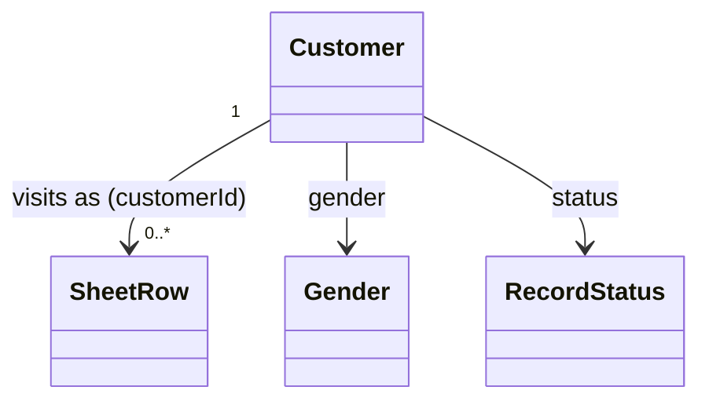

# Customer（customer.dart）

| 新規作成・更新日 | 作成・更新者名 | 作成・更新内容 |
|---|---|---|
| 2026-09-25 | minamiyama | 新規作成 |
| 2026-09-25 | minamiyama | agents.md階層改訂に伴い`domain/entities/`へ移動 |

## 概要

来店した顧客を表すドメインエンティティ。氏名・性別のみを保持する簡易マスタで、[SheetRow](./sheet_row.md)から任意で紐付ける。「NEW様」のように未登録の来店も許容するため、[SheetRow](./sheet_row.md)側のFKはNULL許容とする。DB定義は [db_schema.md](../../../../../../../requried/db_schema.md) §5.6 `m_customer` に対応する。

## 依存関係シーケンス図

## 項目一覧

| 項目論理名 | 項目物理名 | カプセルの型 | データ型 | バリデーション | 備考 |
|---|---|---|---|---|---|
| 顧客ID | customerId | - | string | 必須, ULID形式 | PK |
| 氏名 | name | - | string | 必須 | 「NEW様」等、未確定の呼称も許容 |
| 性別 | gender | - | [Gender](./enums/gender.md) | 必須 | デフォルト`none`（未指定） |
| 論理削除状態 | status | - | [RecordStatus](./enums/record_status.md) | 必須 | デフォルト`active` |
| 作成日時 | createdAt | - | DateTime | 必須, ISO8601 | - |
| 更新日時 | updatedAt | - | DateTime | 必須, ISO8601 | - |
