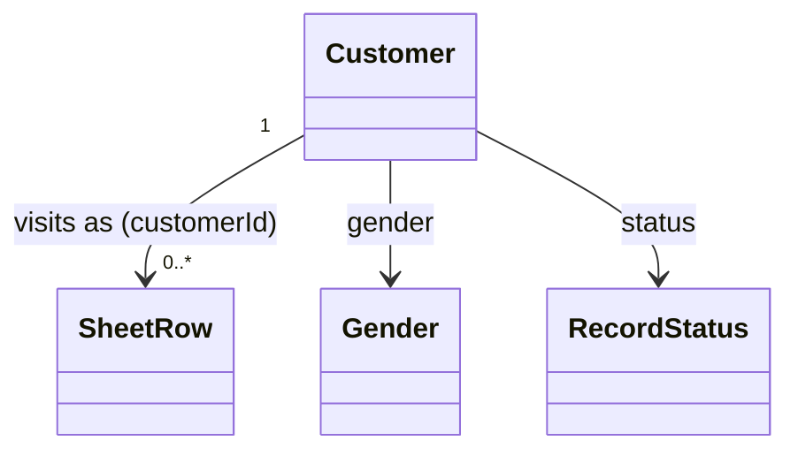

# Customer（customer.dart）

| 新規作成・更新日 | 作成・更新者名 | 作成・更新内容 |
|---|---|---|
| 2026-09-25 | minamiyama | 新規作成 |
| 2026-09-25 | minamiyama | agents.md階層改訂に伴い`domain/entities/`へ移動 |
| 2026-09-27 | minamiyama | 「NEW様」表記から「-様」＋「NEW」マーク表示への変更に伴い説明を更新（[agents.md](../../../../../../../requried/agents.md)参照） |

## 概要

来店した顧客を表すドメインエンティティ。氏名・性別のみを保持する簡易マスタで、[SheetRow](./sheet_row.md)から任意で紐付ける。未登録の来店も許容するため、[SheetRow](./sheet_row.md)側のFKはNULL許容とする。未登録（`SheetRow.customerId`が`null`）の場合、画面の「お名前」列はデフォルトで「-様」と表示し「様」の隣に「NEW」マークを付ける（保存値としての「NEW様」という文字列は持たない）。DB定義は [db_schema.md](../../../../../../../requried/db_schema.md) §5.6 `m_customer` に対応する。

## 依存関係シーケンス図

```mermaid
classDiagram
    Customer "1" --> "0..*" SheetRow : visits as (customerId)
    Customer --> Gender : gender
    Customer --> RecordStatus : status
```

## 項目一覧

| 項目論理名 | 項目物理名 | カプセルの型 | データ型 | バリデーション | 備考 |
|---|---|---|---|---|---|
| 顧客ID | customerId | - | string | 必須, ULID形式 | PK |
| 氏名 | name | - | string | 必須 | [Customer](./customer.md)は氏名が確定した（お名前欄に入力された）顧客のみ作成される。未確定の来店は`Customer`を作成せず`SheetRow.customerId=null`のまま「-様」＋「NEW」マークで表示する |
| 性別 | gender | - | [Gender](./enums/gender.md) | 必須 | デフォルト`none`（未指定） |
| 論理削除状態 | status | - | [RecordStatus](./enums/record_status.md) | 必須 | デフォルト`active` |
| 作成日時 | createdAt | - | DateTime | 必須, ISO8601 | - |
| 更新日時 | updatedAt | - | DateTime | 必須, ISO8601 | - |
