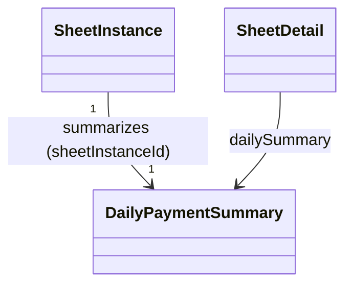

# DailyPaymentSummary（daily_payment_summary.dart）

| 新規作成・更新日 | 作成・更新者名 | 作成・更新内容 |
|---|---|---|
| 2026-09-27 | minamiyama | 新規作成（[agents.md](../../../../../../../requried/agents.md) §2「日機能要件」を反映） |

## 概要

伝票末尾の行に表示する、その日（営業日）の合計金額と決済方法別内訳（現金／カード／PayPay）を表す読み取り専用の集約エンティティ（FR-2）。永続テーブルは持たず、DBのビュー`v_daily_payment_summary`（[db_schema.md](../../../../../../../requried/db_schema.md) §6.1参照）から取得する。[SheetDetail](./sheet_detail.md)に内包され、[VoucherSheetPage](../../presentation/pages/voucher_sheet_page.md)の[VoucherDailySummaryRow](../../presentation/widgets/voucher_daily_summary_row.md)が表示する。

## 依存関係シーケンス図

## 項目一覧

| 項目論理名 | 項目物理名 | カプセルの型 | データ型 | バリデーション | 備考 |
|---|---|---|---|---|---|
| 伝票インスタンスID | sheetInstanceId | - | string | 必須 | - |
| 営業日 | businessDate | - | DateTime | 必須, 日付のみ | - |
| 合計金額 | totalAmount | - | int | 必須 | その日の[SheetRow.totalAmount](./sheet_row.md)の合計。行が0件の場合は0 |
| 現金内訳 | cashAmount | - | int | 必須 | `paymentMethod`が`null`の行の合計 |
| カード内訳 | cardAmount | - | int | 必須 | `paymentMethod=card`の行の合計 |
| PayPay内訳 | paypayAmount | - | int | 必須 | `paymentMethod=paypay`の行の合計 |
