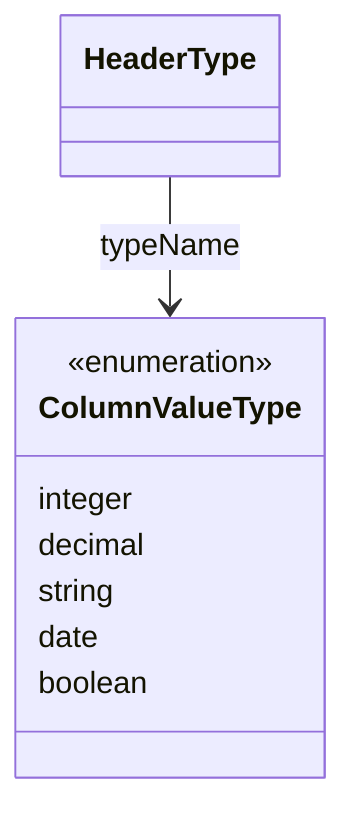

# ColumnValueType（column_value_type.dart）

| 新規作成・更新日 | 作成・更新者名 | 作成・更新内容 |
|---|---|---|
| 2026-09-25 | minamiyama | 新規作成 |
| 2026-09-25 | minamiyama | agents.md階層改訂に伴い`domain/entities/enums/`へ移動 |

## 概要

伝票の列（ヘッダー）に入力できる値の型（DB上の`m_header_type.type_name`カラム、CHECK制約 `int` / `decimal` / `string` / `date` / `boolean`）をアプリ層で型安全に扱うためのenum。
[HeaderType](../header_type.md)の`typeName`フィールドの型として使用し、[Header](../header.md)経由で入力フォームの表示・検証を切り替える際に参照される。`int`はDartの予約型と衝突するため、enum値名は`integer`とする。

## 依存関係シーケンス図

## 項目一覧

| 項目論理名 | 項目物理名 | カプセルの型 | データ型 | バリデーション | 備考 |
|---|---|---|---|---|---|
| 整数 | integer | - | string | DB値 `'int'` に対応 | 数量など整数値の列 |
| 小数 | decimal | - | string | DB値 `'decimal'` に対応 | 単価計算等で小数を扱う列 |
| 文字列 | string | - | string | DB値 `'string'` に対応 | 氏名・備考等のテキスト列 |
| 日付 | date | - | string | DB値 `'date'` に対応 | 日付値の列 |
| 真偽値 | boolean | - | string | DB値 `'boolean'` に対応 | チェックボックス等の列 |
