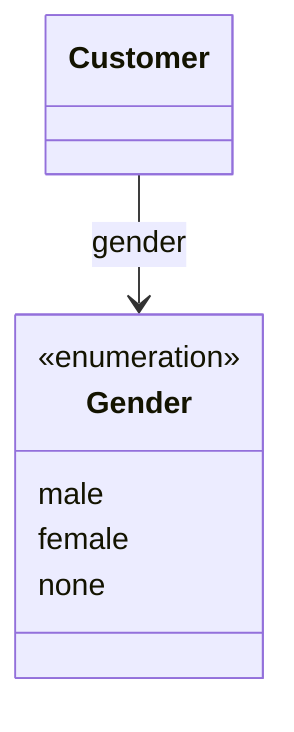

# Gender（gender.dart）

| 新規作成・更新日 | 作成・更新者名 | 作成・更新内容 |
|---|---|---|
| 2026-09-25 | minamiyama | 新規作成 |
| 2026-09-25 | minamiyama | agents.md階層改訂に伴い`domain/entities/enums/`へ移動 |

## 概要

顧客の性別（DB上の`m_customer.gender`カラム、CHECK制約 `male` / `female` / `none`）をアプリ層で型安全に扱うためのenum。
[Customer](../customer.md)の`gender`フィールドの型として使用する。性別は未指定を許容し、デフォルトは`none`（[requirements.md](../../../../../../../../requried/requirements.md) 参照）。

## 依存関係シーケンス図

## 項目一覧

| 項目論理名 | 項目物理名 | カプセルの型 | データ型 | バリデーション | 備考 |
|---|---|---|---|---|---|
| 男性 | male | - | string | DB値 `'male'` に対応 | - |
| 女性 | female | - | string | DB値 `'female'` に対応 | - |
| 未指定 | none | - | string | DB値 `'none'` に対応 | デフォルト値 |
