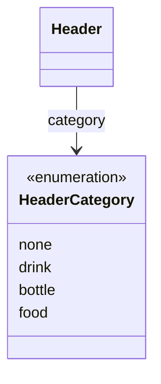

# HeaderCategory（header_category.dart）

| 新規作成・更新日 | 作成・更新者名 | 作成・更新内容 |
|---|---|---|
| 2026-09-29 | minamiyama | 新規作成（ヘッダー管理機能、FR-6） |

## 概要

ヘッダー（列）のカテゴリー（DB上の`category`カラム、CHECK制約 `none` / `drink` / `bottle` / `food`）をアプリ層で型安全に扱うための共有enum。[Header](../header.md)の`category`フィールドの型として使用し、伝票入力画面（`MMM_001_VOUCHER`）のヘッダーセルの色分け表示（FR-6）に用いる。

## 依存関係シーケンス図

## 項目一覧

| 項目論理名 | 項目物理名 | カプセルの型 | データ型 | バリデーション | 備考 |
|---|---|---|---|---|---|
| 未指定 | none | - | string | DB値 `'none'` に対応 | デフォルト値 |
| ドリンク | drink | - | string | DB値 `'drink'` に対応 | - |
| ボトル | bottle | - | string | DB値 `'bottle'` に対応 | - |
| フード | food | - | string | DB値 `'food'` に対応 | - |
