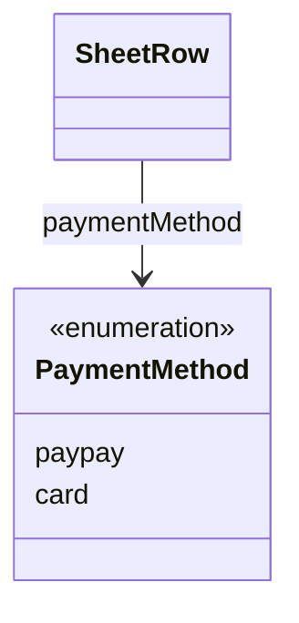

# PaymentMethod（payment_method.dart）

| 新規作成・更新日 | 作成・更新者名 | 作成・更新内容 |
|---|---|---|
| 2026-09-27 | minamiyama | 新規作成（[agents.md](../../../../../../../../requried/agents.md)の決済方法仕様を反映） |

## 概要

決済方法（DB上の`t_row.payment_method`カラム、CHECK制約 `paypay` / `card`）をアプリ層で型安全に扱うためのenum。
[SheetRow](../sheet_row.md)の`paymentMethod`フィールドの型として使用する。紙伝票の「合計金額」列に隣接する「P」「カ」の丸印に対応し、`paymentMethod`が`null`の場合は現金決済（どちらにも丸をつけない）を意味する。現金は専用の列挙値を持たず、`null`で表現する点に注意する（[db_schema.md](../../../../../../../../requried/db_schema.md) §5.8参照）。

## 依存関係シーケンス図

## 項目一覧

| 項目論理名 | 項目物理名 | カプセルの型 | データ型 | バリデーション | 備考 |
|---|---|---|---|---|---|
| PayPay決済 | paypay | - | string | DB値 `'paypay'` に対応 | 「P」に丸をつける決済 |
| カード決済 | card | - | string | DB値 `'card'` に対応 | 「カ」に丸をつける決済 |

現金決済は本enumの値ではなく、[SheetRow.paymentMethod](../sheet_row.md)が`null`であることで表現する。
