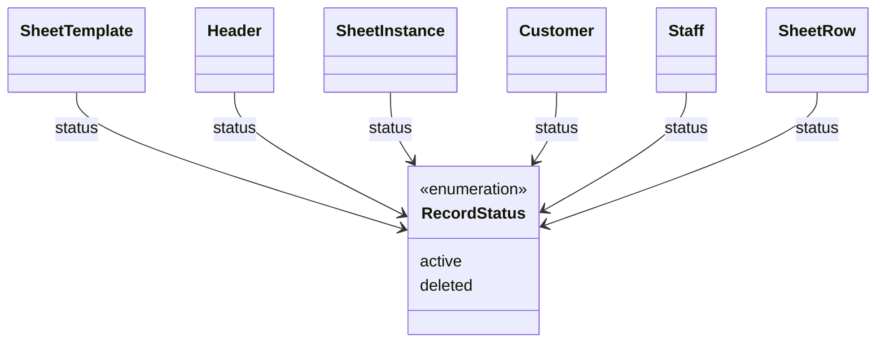

# RecordStatus（record_status.dart）

| 新規作成・更新日 | 作成・更新者名 | 作成・更新内容 |
|---|---|---|
| 2026-09-25 | minamiyama | 新規作成 |
| 2026-09-25 | minamiyama | agents.md階層改訂に伴い`domain/entities/enums/`へ移動 |

## 概要

論理削除フラグ（DB上の`status`カラム、CHECK制約 `active` / `deleted`）をアプリ層で型安全に扱うための共有enum。
[SheetTemplate](../sheet_template.md)・[Header](../header.md)・[SheetInstance](../sheet_instance.md)・[Customer](../customer.md)・[Staff](../staff.md)・[SheetRow](../sheet_row.md)の`status`フィールドの型として使用する。物理削除は行わず、`deleted`への更新のみで論理削除を表現する（[db_schema.md](../../../../../../../../requried/db_schema.md) §9 運用ルール参照）。

## 依存関係シーケンス図

## 項目一覧

| 項目論理名 | 項目物理名 | カプセルの型 | データ型 | バリデーション | 備考 |
|---|---|---|---|---|---|
| 有効 | active | - | string | DB値 `'active'` に対応 | 通常の表示・利用が可能な状態 |
| 削除済み | deleted | - | string | DB値 `'deleted'` に対応 | 論理削除済み。UIから非表示にするが過去データは保持する |
