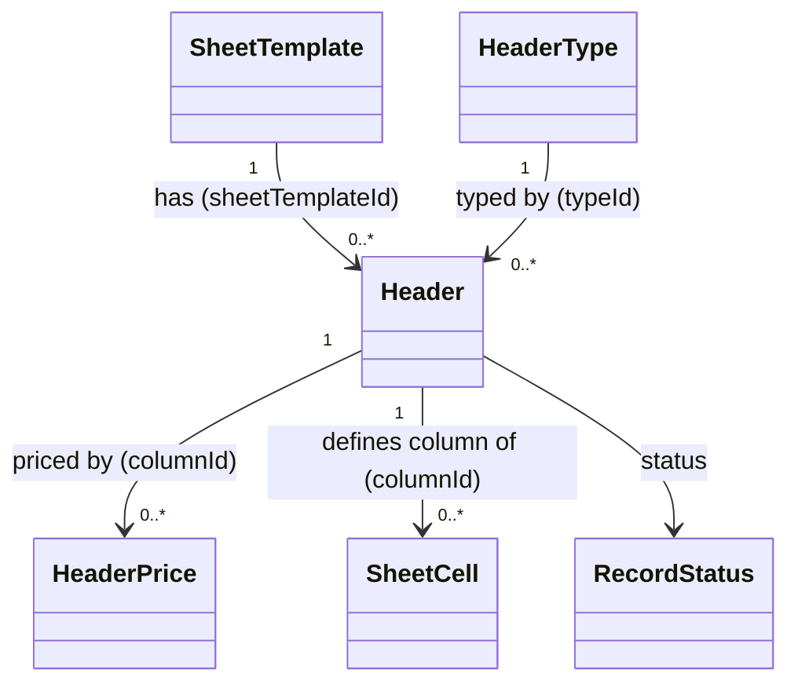

# Header（header.dart）

| 新規作成・更新日 | 作成・更新者名 | 作成・更新内容 |
|---|---|---|
| 2026-09-25 | minamiyama | 新規作成 |
| 2026-09-25 | minamiyama | agents.md階層改訂に伴い`domain/entities/`へ移動 |

## 概要

伝票の列定義（ヘッダー）を表すドメインエンティティ。[SheetTemplate](./sheet_template.md)配下に複数存在し、列名・表示順・入力型（[HeaderType](./header_type.md)）・価格対象かどうか（`isPriced`）を持つ。単価そのものは保持せず、価格改定履歴である[HeaderPrice](./header_price.md)から取得する。列構成の増減は本テーブルへの行追加／`status=deleted`で対応する（FR-1）。DB定義は [db_schema.md](../../../../../../../requried/db_schema.md) §5.3 `m_header` に対応する。

## 依存関係シーケンス図

## 項目一覧

| 項目論理名 | 項目物理名 | カプセルの型 | データ型 | バリデーション | 備考 |
|---|---|---|---|---|---|
| 列ID | columnId | - | string | 必須, ULID形式 | PK |
| 伝票フォーマットID | sheetTemplateId | - | string | 必須, FK→[SheetTemplate](./sheet_template.md) | どのフォーマットの列か |
| 型ID | typeId | - | int | 必須, FK→[HeaderType](./header_type.md) | 入力値の型 |
| 列名 | name | - | string | 必須 | 例:「チャージ」「お茶ハイ」 |
| 表示順 | displayOrder | - | int | 必須 | 昇順で表示。列の並び順変更時に更新する |
| 価格対象フラグ | isPriced | - | bool | 必須 | `true`の場合[SheetCell](./sheet_cell.md)は`quantity`×`unitPriceApplied`方式、`false`の場合`content`方式を使う |
| 論理削除状態 | status | - | [RecordStatus](./enums/record_status.md) | 必須 | デフォルト`active`。削除後も過去の[SheetCell](./sheet_cell.md)は保持する |
| 作成日時 | createdAt | - | DateTime | 必須, ISO8601 | - |
| 更新日時 | updatedAt | - | DateTime | 必須, ISO8601 | - |
