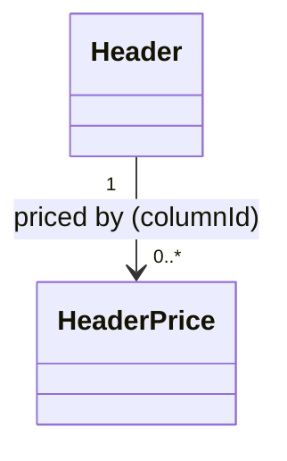

# HeaderPrice（header_price.dart）

| 新規作成・更新日 | 作成・更新者名 | 作成・更新内容 |
|---|---|---|
| 2026-09-25 | minamiyama | 新規作成 |
| 2026-09-25 | minamiyama | agents.md階層改訂に伴い`domain/entities/`へ移動 |

## 概要

列（[Header](./header.md)）ごとの単価改定履歴を表すドメインエンティティ。単価は期間（`effectiveFrom`〜`effectiveTo`）で管理し、価格改定時は既存レコードの`effectiveTo`に改定日をセットして新しいレコードを追加する（履歴は物理削除しない）。現在有効な単価の取得ロジックは[InputCellUsecase](../usecases/input_cell_usecase.md)から参照される。DB定義は [db_schema.md](../../../../../../../requried/db_schema.md) §5.4 `m_header_price` に対応する。

## 依存関係シーケンス図

## 項目一覧

| 項目論理名 | 項目物理名 | カプセルの型 | データ型 | バリデーション | 備考 |
|---|---|---|---|---|---|
| 価格ID | priceId | - | string | 必須, ULID形式 | PK |
| 列ID | columnId | - | string | 必須, FK→[Header](./header.md) | 対象の列 |
| 単価 | price | - | int | 必須 | 単位は円 |
| 適用開始日 | effectiveFrom | - | DateTime | 必須, 日付のみ(YYYY-MM-DD) | - |
| 適用終了日 | effectiveTo | optional | DateTime | 任意, 日付のみ(YYYY-MM-DD) | `null`なら現在も有効 |
| 作成日時 | createdAt | - | DateTime | 必須, ISO8601 | - |
| 更新日時 | updatedAt | - | DateTime | 必須, ISO8601 | - |
