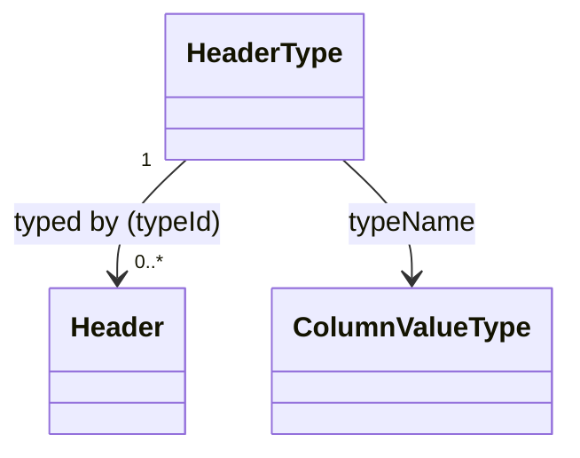

# HeaderType（header_type.dart）

| 新規作成・更新日 | 作成・更新者名 | 作成・更新内容 |
|---|---|---|
| 2026-09-25 | minamiyama | 新規作成 |
| 2026-09-25 | minamiyama | agents.md階層改訂に伴い`domain/entities/`へ移動 |

## 概要

伝票の列（[Header](./header.md)）に入力できる値の型を定義する固定小規模マスタのエンティティ。`int` / `decimal` / `string` / `date` / `boolean`の5種類のみを保持し、アプリ起動時にシードデータとして投入される（[db_schema.md](../../../../../../../requried/db_schema.md) §8参照）。入力フォームの表示制御・値検証の切り替えに使用する。DB定義は同§5.2 `m_header_type` に対応する。

## 依存関係シーケンス図

## 項目一覧

| 項目論理名 | 項目物理名 | カプセルの型 | データ型 | バリデーション | 備考 |
|---|---|---|---|---|---|
| 型ID | typeId | - | int | 必須, PK | DBの`AUTOINCREMENT`連番。固定小規模マスタのためULIDではなくINTEGERを採用 |
| 型名 | typeName | - | [ColumnValueType](./enums/column_value_type.md) | 必須, ユニーク | - |
| 作成日時 | createdAt | - | DateTime | 必須, ISO8601 | - |
| 更新日時 | updatedAt | - | DateTime | 必須, ISO8601 | - |
