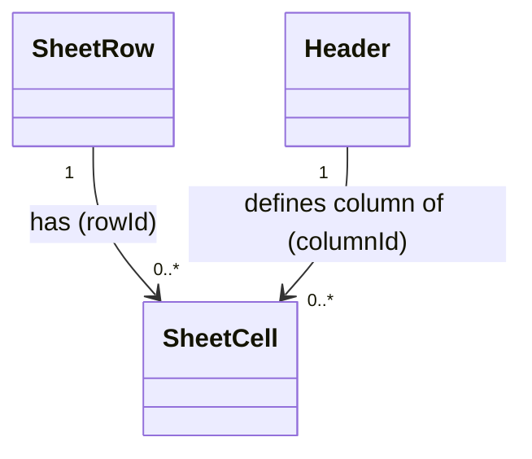

# SheetCell（sheet_cell.dart）

| 新規作成・更新日 | 作成・更新者名 | 作成・更新内容 |
|---|---|---|
| 2026-09-25 | minamiyama | 新規作成 |
| 2026-09-25 | minamiyama | agents.md階層改訂に伴い`domain/entities/`へ移動 |

## 概要

セルの値（ボディ）を表すドメインエンティティ。DBの物理テーブル名は`t_cell`だが、Flutter標準の`Cell`系ウィジェット・概念との混同を避けるため、Dartクラス名は`SheetCell`とする。[SheetRow](./sheet_row.md)と[Header](./header.md)の組ごとに1件存在し、`(rowId, columnId)`はユニーク制約を持つ。[Header](./header.md)の`isPriced`が`true`の列は`quantity`×`unitPriceApplied`方式（`amount`はアプリ側で計算して保存）、`false`の列は`content`方式を使う。DB定義は [db_schema.md](../../../../../../../requried/db_schema.md) §5.9 `t_cell` に対応する。

## 依存関係シーケンス図

## 項目一覧

| 項目論理名 | 項目物理名 | カプセルの型 | データ型 | バリデーション | 備考 |
|---|---|---|---|---|---|
| セルID | cellId | - | string | 必須, ULID形式 | PK |
| 行ID | rowId | - | string | 必須, FK→[SheetRow](./sheet_row.md) | `(rowId, columnId)`でユニーク |
| 列ID | columnId | - | string | 必須, FK→[Header](./header.md) | `(rowId, columnId)`でユニーク |
| 内容 | content | optional | string | 任意 | 文字列・日付など数量概念のない列の値。`isPriced=false`の列で使用 |
| 数量 | quantity | optional | int | 任意 | `isPriced=true`の列でのみ使用 |
| 適用単価 | unitPriceApplied | optional | int | 任意 | 入力時点で[HeaderPrice](./header_price.md)から取得し保存した単価のスナップショット。後日の価格改定の影響を受けない |
| 金額 | amount | optional | int | 任意 | `quantity * unitPriceApplied`。アプリ側で計算して保存する |
| 作成日時 | createdAt | - | DateTime | 必須, ISO8601 | - |
| 更新日時 | updatedAt | - | DateTime | 必須, ISO8601 | - |
