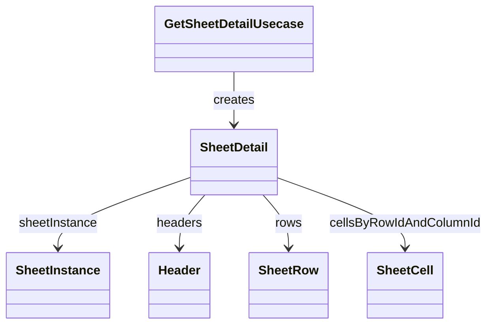

# SheetDetail（sheet_detail.dart）

| 新規作成・更新日 | 作成・更新者名 | 作成・更新内容 |
|---|---|---|
| 2026-09-25 | minamiyama | 新規作成（presentation層の画面表示用に追加） |

## 概要

伝票入力画面（`ENT_001_VOUCHER`）の描画に必要なデータを1つに束ねた読み取り専用の集約DTO。[SheetInstance](./sheet_instance.md)・[Header](./header.md)一覧・[SheetRow](./sheet_row.md)一覧・[SheetCell](./sheet_cell.md)を、行×列の参照がO(1)になるようネスト済みMapとして保持する。[GetSheetDetailUsecase](../usecases/get_sheet_detail_usecase.md)が生成し、[VoucherSheetNotifier](../../presentation/controllers/voucher_sheet_notifier.md)が[VoucherSheetState](../../presentation/controllers/voucher_sheet_state.md)へ格納する。

## 依存関係シーケンス図

## 項目一覧

| 項目論理名 | 項目物理名 | カプセルの型 | データ型 | バリデーション | 備考 |
|---|---|---|---|---|---|
| 伝票インスタンス | sheetInstance | - | [SheetInstance](./sheet_instance.md) | 必須 | - |
| 列一覧 | headers | list | [Header](./header.md) | 必須 | `displayOrder`昇順 |
| 行一覧 | rows | list | [SheetRow](./sheet_row.md) | 必須 | `rowOrder`昇順 |
| 行列キー別セルMap | cellsByRowIdAndColumnId | map | string(key), map<string, [SheetCell](./sheet_cell.md)>(value) | 必須 | 外側キー=rowId、内側キー=columnId。画面描画時にO(1)で参照するための事前変換済みデータ |
