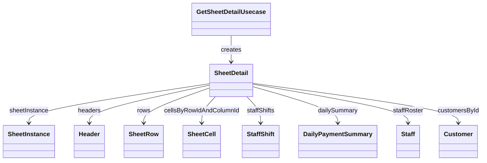

# SheetDetail（sheet_detail.dart）

| 新規作成・更新日 | 作成・更新者名 | 作成・更新内容 |
|---|---|---|
| 2026-09-25 | minamiyama | 新規作成（presentation層の画面表示用に追加） |
| 2026-09-27 | minamiyama | `staffShifts`・`dailySummary`・`staffRoster`・`customersById`を追加（[agents.md](../../../../../../../requried/agents.md)のスタッフ欄・日機能要件・お名前列仕様を反映） |

## 概要

伝票入力画面（`MMM_001_VOUCHER`）の描画に必要なデータを1つに束ねた読み取り専用の集約DTO。[SheetInstance](./sheet_instance.md)・[Header](./header.md)一覧・[SheetRow](./sheet_row.md)一覧・[SheetCell](./sheet_cell.md)・[StaffShift](./staff_shift.md)一覧・[DailyPaymentSummary](./daily_payment_summary.md)・スタッフ選択肢一覧を、行×列の参照がO(1)になるようネスト済みMapとして保持する。[GetSheetDetailUsecase](../usecases/get_sheet_detail_usecase.md)が生成し、[VoucherSheetNotifier](../../presentation/controllers/voucher_sheet_notifier.md)が[VoucherSheetState](../../presentation/controllers/voucher_sheet_state.md)へ格納する。

## 依存関係シーケンス図

```mermaid
classDiagram
    SheetDetail --> SheetInstance : sheetInstance
    SheetDetail --> Header : headers
    SheetDetail --> SheetRow : rows
    SheetDetail --> SheetCell : cellsByRowIdAndColumnId
    SheetDetail --> StaffShift : staffShifts
    SheetDetail --> DailyPaymentSummary : dailySummary
    SheetDetail --> Staff : staffRoster
    SheetDetail --> Customer : customersById
    GetSheetDetailUsecase --> SheetDetail : creates
```

## 項目一覧

| 項目論理名 | 項目物理名 | カプセルの型 | データ型 | バリデーション | 備考 |
|---|---|---|---|---|---|
| 伝票インスタンス | sheetInstance | - | [SheetInstance](./sheet_instance.md) | 必須 | - |
| 列一覧 | headers | list | [Header](./header.md) | 必須 | `displayOrder`昇順 |
| 行一覧 | rows | list | [SheetRow](./sheet_row.md) | 必須 | `rowOrder`昇順 |
| 行列キー別セルMap | cellsByRowIdAndColumnId | map | string(key), map<string, [SheetCell](./sheet_cell.md)>(value) | 必須 | 外側キー=rowId、内側キー=columnId。画面描画時にO(1)で参照するための事前変換済みデータ |
| スタッフシフト一覧 | staffShifts | list | [StaffShift](./staff_shift.md) | 必須 | 右上「スタッフ」欄の表示用。[VoucherStaffBar](../../presentation/widgets/voucher_staff_bar.md)が表示する。3件未満の場合、[OpenSheetInstanceUsecase](../usecases/open_sheet_instance_usecase.md)が空のシフト枠を自動作成するため通常は3件 |
| 日次集計 | dailySummary | - | [DailyPaymentSummary](./daily_payment_summary.md) | 必須 | 伝票末尾の行（[VoucherDailySummaryRow](../../presentation/widgets/voucher_daily_summary_row.md)）の表示用 |
| スタッフ選択肢一覧 | staffRoster | list | [Staff](./staff.md) | 必須 | 有効なスタッフ一覧（[StaffRepository.findAllActive](../repositories/staff_repository.md)）。「担当」列プルダウンおよび[VoucherStaffBar](../../presentation/widgets/voucher_staff_bar.md)の氏名プルダウンの選択肢として使用する |
| 顧客ID別顧客Map | customersById | map | string(key), [Customer](./customer.md)(value) | 必須 | キー=customerId。`rows`のうち`customerId`が非`null`の行の氏名表示用。「お名前」列の表示時に`row.customerId`が`null`であれば「-様」＋「NEW」マーク、非`null`であれば本Mapから引いた氏名＋「様」を表示する |
